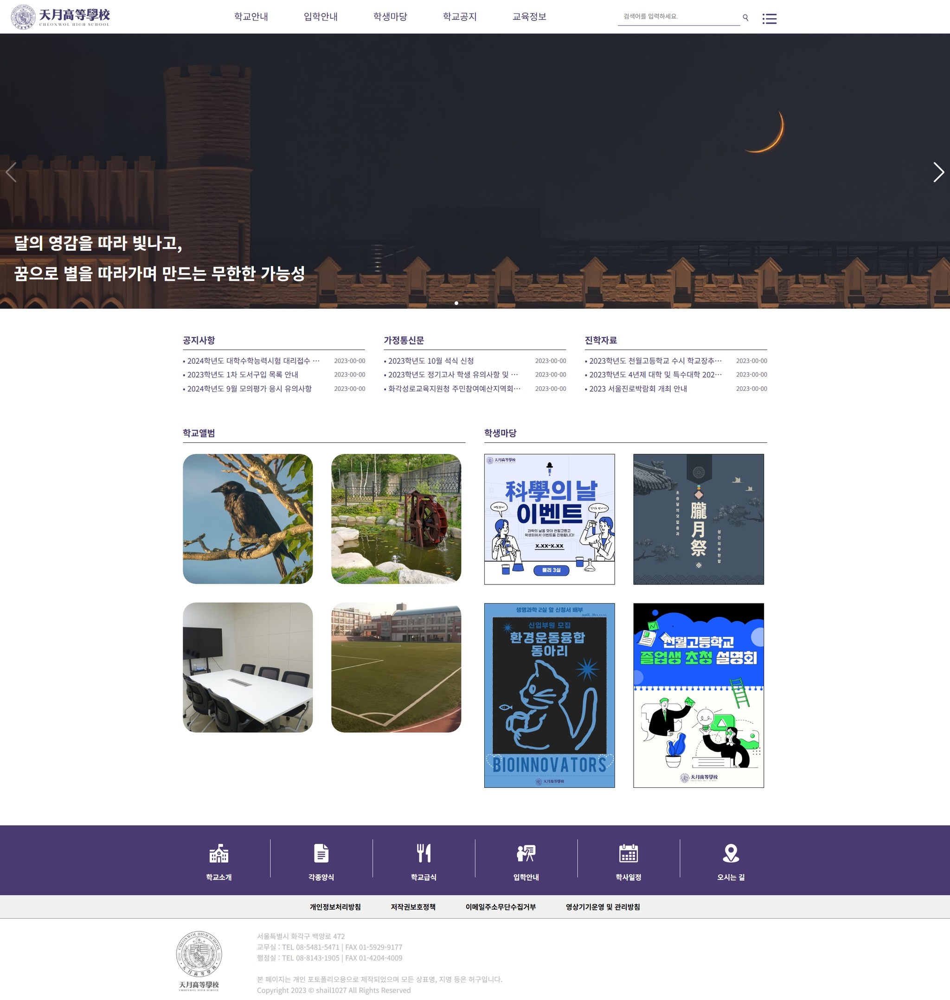
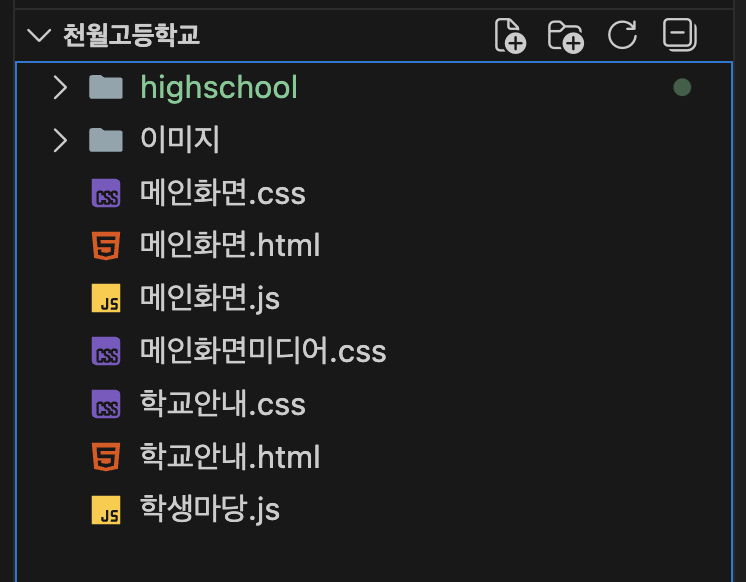
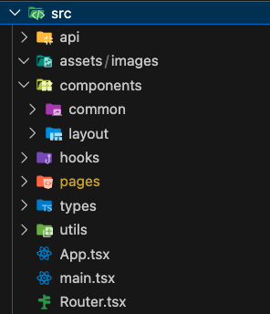
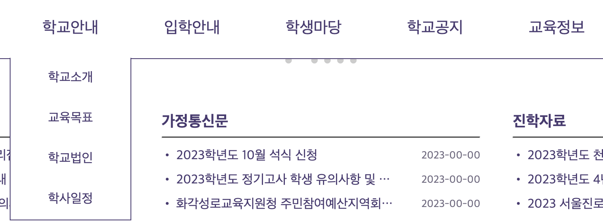
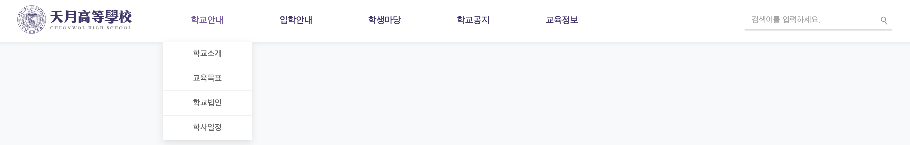

## 프로젝트 개요

 학부 1학년 때 혼자 웹을 공부 해봤었는데, 너무 재밌어서 평소에 생각하던 가상의 학교를 직접 사이트로 만들어보고자 했다. 그렇게 로고도 디자인하고, 사이트도 다른 고등학교의 웹사이트를 열심히 참고해가며 디자인을 했다. 생 HTML과 CSS코드를 1000줄 정도 치고 뿌듯해 했었던 기억이 있다.(AI도 없었을 떄라 정말 어떻게 했나 싶다...) 지금와서 다시 열어보니까 디자인도 아쉽고, 프로젝트 구조, 완성도 등등... 아쉬운 점이 많아서 React를 공부하는 겸 예전에 했던 이 프로젝트를 리팩토링 하기로 했다. 원래 프론트만 있었는데 Spring Boot를 공부할 겸 풀스택 프로젝트로 진행해보기로 했다.

*기존 사이트 디자인*


## 초기 세팅

우선 초기 세팅부터 진행했다. 기존 프로젝트의 파일 구조는... 그냥 폴더 안에 전부 때려박았다. 그와중에 고맙게도 이미지는 따로 빼주어서 이미지를 골라내는 수고를 덜 수 있었다.

*기존 프로젝트 파일 구조*


천월고 v2의 프론트는 React를 사용하기로 했다. 이전에 사용해본 적이 있기도 하고, 제대로 다시 공부해보고 싶었기 때문이다. 

*React 프로젝트 생성*

```bash
npm create vite@latest frontend -- --template react-ts
```

React를 처음 공부했을 때 폴더 구조가 너무 복잡해서 손대기가 어려웠던 기억이 있다. 

- `main.tsx`: 프로그램의 시작점
- `App.tsx`: 최상위 컴포넌트

이 두 파일을 제외하고 전부 삭제했다. 또한, 예전에 했던 프로젝트의 폴더 구조를 참고해서 아래와 같이 초기세팅을 진행했다.

```bash
mkdir -p assets/images components/common components/layout pages hooks types api utils
```




## Header 제작

먼저 사이트의 최상단에 위치한 헤더부터 리팩토링을 진행했다. 기본적으로 id나 class의 이름은 그대로 유지하되, 어감이 이상하거나 뜻이 맞지 않는 것에 한에 변경했다.

- `components/common`: 버튼, 인풋, 모달 등 범용 컴포넌트
- `components/layout`: 헤더, 푸터, 사이드바 등 레이아웃 관련 컴포넌트

이런 식으로 마우스를 hover하면 drop down하는 형태의 메뉴이다.

*기존 사이트 디자인*


우선, `components/layout` 폴더에 `Header.tsx`를 만들고 작업을 시작했다.
```html
  return (
    <header id="header">
      <div className="logo">
        <Link to="/" className="menu-a">
          </img>
        </Link>
      </div>
      <nav className="nav-div">
        <ul className="nav-nav">
          {/* 1. 학교안내 */}
          <li>
            <span className="gaid-school topmain">
              <Link to="/intro" className="menu-a">
                학교안내
              </Link>
            </span>
            <ul className="drop-down menu1">
              <li>
                <Link to="/intro" className="menu-a">
                  학교소개
                </Link>
              ...
              </li>
            </ul>
          </li>
        ...
    </header>
  );
};

export default Header;
```

기존에는 `<a>`태그로 되어있는 요소들은 전부 `<Link>` 컴포넌트로 대체했다. 또한, 검색바가 기존 코드에서는 메뉴 리스트인 `<ul>`태그 안에 갇혀있어서 오른쪽 정렬이 제대로 되지 않았기에 구조를 수정해서 `</ul>`뒤로 옮겨주었다.

기존 프로젝트에서 `학생 마당`을 클릭하면 권한이 없다는 alert가 떴다. 물론 서버가 없었기에 그냥 alert코드를 집어넣어서 구현했었지만, 처음 자바스크립트를 사용해서 신기해했던 기억이 있다.

*기존 코드*
```html
<li>
    <a href="javascript:alert('접근권한이 없습니다.\n로그인 해주십시오.');" onfocus="this.blur()" class="menu-a">학생회</a>
</li>
<li>
    <a href="javascript:alert('접근권한이 없습니다.\n로그인 해주십시오.');" onfocus="this.blur()" class="menu-a">동아리활동</a>
</li>
```

그래서 서버 구현 전까지 똑같이 alert만 나오도록 코드를 짰다.

```javascript
const handleRestrictedClick = (e: React.MouseEvent) => {
    e.preventDefault();
    alert("접근 권한이 없습니다.");
  };
```

`App.tsx`와 `Router.tsx`를 수정해서 실행시켜봤다.

```js
function App() {
  return (
    <BrowserRouter>
      <Header></Header>
      <div style={{ paddingTop: "60px" }}>
        <Router />
      </div>
    </BrowserRouter>
  );
};
```




나름... 기존 스타일과 색을 유지하면서 괜찮은 디자인으로 뽑혔다고 생각한다. 


## 다음 과정

-  `Header.tsx`구조 변경(코드가 너무 길고, 반복이 많다!)
-  메인 페이지 디자인+코딩