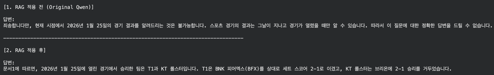
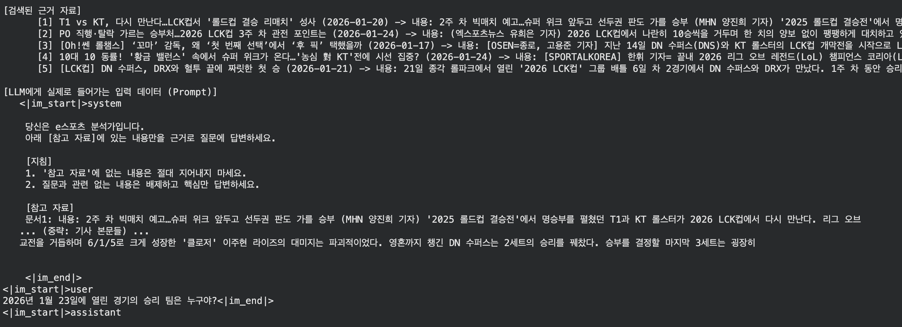
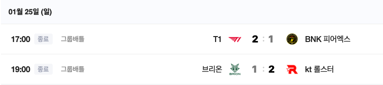
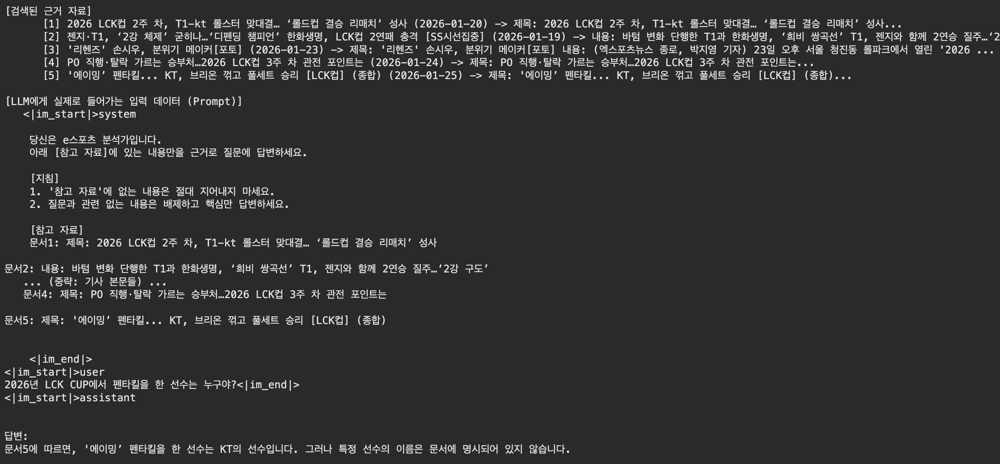
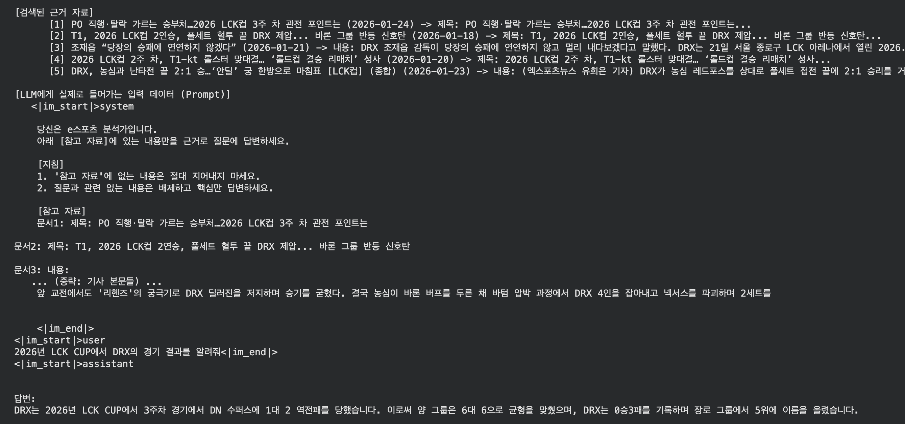
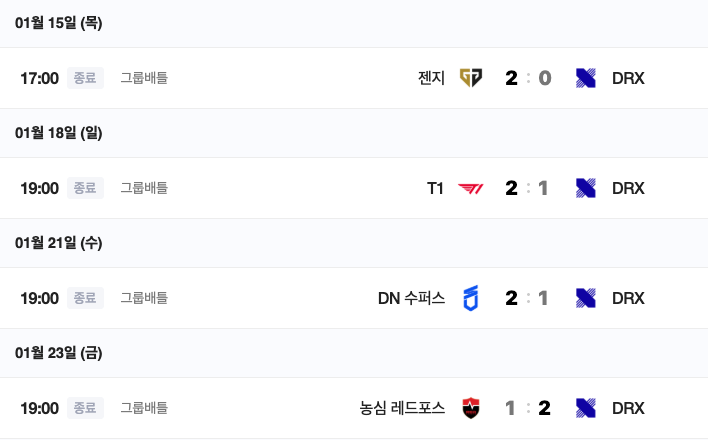
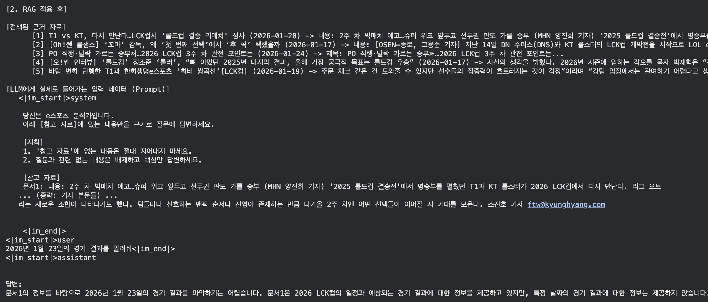
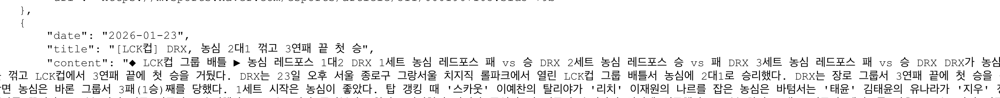

## 1. 프로젝트 개요

### 주제 선정 이유
LLM(Large Language Model)은 학습 시점(Cut-off) 이후의 데이터는 모른다는 치명적인 한계가 있다. 예를 들어 학습 데이터에 없는 **2026년 LCK CUP의 경기 결과**를 물어보면 환각(Hallucination) 증세를 보이며 잘못된 대답을 한다.

따라서 이를 해결하기 위해 최신 뉴스 데이터를 검색해서 LLM에게 제공하는 **RAG(Retrieval-Augmented Generation)** 기술을 도입했다. 특히단순히 정답만 맞추는 것을 넘어, 질문에 대해 **검색된 뉴스 기사 원문(Context)**을 함께 출력하여 어떤 근거로 답변이 생성되었는지 투명하게 보여주는 것을 목표로 삼았다.

### 사용 기술 스택 (Tech Stack)
* **Language:** Python 3.10
* **Data Collection:** Playwright, BeautifulSoup (네이버 e스포츠 뉴스 크롤링)
* **LLM:** Qwen2-7B-Instruct 
* **Vector DB:** ChromaDB
* **Embedding:** jhgan/ko-sroberta-multitask (한국어 특화 모델)
* **Search Optimization:** Hybrid Search (BM25 + Vector) + Cross-Encoder Re-ranker


## 2. 구현 과정

프로젝트는 크게 데이터 수집, 벡터 DB 구축, 그리고 검색 및 생성 테스트의 3단계로 진행했다.

### 단계 1: 데이터 선정 및 크롤링 

RAG의 성능은 "참조하는 데이터의 질"이 결정한다. 가장 신뢰할 수 있는 2026년 LCK 경기 결과를 얻기 위해 [**네이버 e스포츠 뉴스**](https://m.game.naver.com/esports/League_of_Legends/home)를 타겟으로 잡았다.

처음에는 `Selenium`을 고려했으나, 페이지 로딩 속도와 동적 콘텐츠 처리 효율을 위해 **Playwright**를 선택했다. `auto-wait` 기능 덕분에 별도의 `time.sleep()` 없이도 안정적으로 기사 본문을 긁어올 수 있었다.

시즌이 시작된 1월 14일부터 코드를 작성할 당시까지의 최신 날짜인 1월 27일까지, 총 14일치 뉴스를 대상으로 크롤링을 진행했다.

**1.  Playwright로 뉴스 리스트 페이지 접근**
```python
target_url = f"{BASE_URL}?date={date}" # 날짜별 뉴스 리스트 URL 생성
try:
    # Playwright로 해당 페이지 접속
    await page.goto(target_url, timeout=30000, wait_until="domcontentloaded")

    # 목록 로딩 대기 
    try:
        await page.wait_for_selector("li[class*="news_card_item"]", timeout=6000)
    except:
        continue
```

**2.  각 기사의 URL 수집**
```python
# 모든 뉴스 카드 요소 가져오기
cards = await page.query_selector_all("li[class*="news_card_item"]")
for card in cards:
    link_el = await card.query_selector("a") # 카드 내의 링크 태그 찾기
    if link_el:
        href = await link_el.get_attribute("href") # URL 추출
        
        # ... (제목 미리보기 추출) ...

        if href:
            # 수집된 링크 저장
            collected_links.append({
                "date": date,
                "url": href,
                "title": title_preview
            })
```
**3.  BeautifulSoup으로 기사 본문(Title, Content) 파싱 및 정제**
```python
# Playwright가 렌더링한 HTML을 가져와서 BS4로 파싱
html = await page.content()
soup = BeautifulSoup(html, "html.parser")

# 본문 찾기 (네이버 뉴스 구조가 다양하므로 여러 후보군 설정)
content_candidates = [
    soup.select_one("#newsct_article"),          
    soup.select_one(".NewsEndMain_article_body"), 
    soup.select_one("#dic_area"),                
    soup.select_one("._article_body")            
]

# ...

# 제목 찾기
title_candidates = [
    soup.select_one(".media_end_head_headline"),
    soup.select_one("#title_area"),
    soup.select_one(".NewsEndMain_title")
]
```
**4.  불필요한 태그 및 광고 제거 후 텍스트 데이터 확보**
```python
if content_elem:
    # 불필요한 태그(스크립트, 광고, 이미지 설명, 기자정보) 제거
    for tag in content_elem.select("script, style, iframe, .img_desc, .end_photo_org, .reporter_area"):
        tag.decompose() 

    # 태그가 제거된 순수 텍스트 추출 
    body_text = content_elem.get_text(separator=" ", strip=True)

    if len(body_text) > 30:
        final_dataset.append({
            # ... 데이터 저장 ...
        })
```

**크롤링 결과**
```json
[
    {
        "date": "2026-01-14",
        "title": "2026 LCK컵, '체급이 다르다' 증명한 DK... 브리온 54분 셧아웃, 장로 그룹 2연승 질주",
        "content": "신인 로스터도 흔들림 없다... (중략) ... '쇼메이커' 중심 체급 증명 르블랑 원맨쇼부터 자르반 차력까지,
         LCK컵 초반부터 장로 그룹의 흐름을 쥔 DK가 어디까지 질주할 수 있을지 관심이 쏠린다.",
        "url": "https://m.sports.naver.com/esports/article/450/0000148361?sid3=79b"
    },
```


### 단계 2: 벡터 DB 구축 

수집한 텍스트 데이터를 LLM이 이해할 수 있는 형태인 "임베딩 벡터"로 변환하여 저장했다.

**1. 청킹 (Chunking)**

긴 뉴스 기사를 통째로 넣으면 검색 정확도가 떨어진다. 의미 단위로 적절히 자르는 것이 중요하다. `RecursiveCharacterTextSplitter`를 사용하여 무작정 글자 수로 자르는 것이 아닌, 문단(`\n\n`), 문장(`\n`), 단어(` `) 단위로 우선순위를 두고 청킹했다.
```python
text_splitter = RecursiveCharacterTextSplitter(
    chunk_size=1000,   # 하나의 청크당 최대 길이 (문자 수)
    chunk_overlap=200, # 청크 간 겹치는 구간 (문맥 끊김 방지)
    separators=["\n\n", "\n", " ", ""] # 자르는 기준 우선순위
)

split_docs = text_splitter.split_documents(documents)
```

**2. 임베딩 (Embedding)**

한국어 처리에 특화된 `jhgan/ko-sroberta-multitask` 모델을 사용했다. 이 모델은 `Sentence-BERT(SBERT)` 기반으로, 한국어 문장 간의 의미적 유사성을 파악하는 데 특화되어 있다.
```python
embedding_model = HuggingFaceEmbeddings(
    model_name="jhgan/ko-sroberta-multitask", # 한국어 특화 모델
    model_kwargs={"device": "cpu"}, # GPU가 있다면 "cuda"로 변경 가능
    encode_kwargs={"normalize_embeddings": True} # 코사인 유사도 계산을 위해 정규화
)
```

**3. ChromaDB 저장**

가볍고 설정이 간편한 **ChromaDB**를 선택했다.
```python
vectordb = Chroma.from_documents(
    documents=split_docs,      # 쪼개진 텍스트 데이터
    embedding=embedding_model, # 사용할 임베딩 모델
    persist_directory=DB_PATH  # 데이터가 저장될 로컬 경로
)
```

### 단계 3: 테스트 

구축한 RAG 파이프라인(Vector Search 기반)이 잘 작동하는지 확인하기 위해 몇 가지 질문을 던져봤다.

> 2026년 1월 25일에 열린 경기의 승리 팀은 누구야?

**답변**


**근거**


**정답**



## 3. 한계점

### Context 인식 실패

> 2026년 LCK CUP에서 펜타킬을 한 선수는 누구야?

**답변**


제목에 '에이밍'이라고 적혀있는데도 이를 인명으로 인식하지 못하거나, 문맥을 제대로 파악하지 못했다. 


### 불완전한 대답

> 2026년 LCK CUP에서 DRX의 경기 결과를 알려줘

**답변**



**정답**



DRX는 학습된 날짜 기준으로 1승 3패였으나, 0승 3패로 잘못 대답했다.

단순히 상위 5개 문서만 끊어서 가져오다 보니, 기사의 핵심 내용이 잘리거나 여러 기사의 내용이 뒤섞이면서 답변의 품질이 급격히 떨어졌다. 또한 질문과 전혀 상관없는 "양 그룹 균형" 같은 뉴스 기사의 사족까지 그대로 읊었다.

### 유사도 검색의 한계


> 2026년 1월 23일의 경기 결과를 알려줘
>

**답변**




기사가 제대로 데이터화 되어있는 모습이다.

'경기 결과'를 물어봤을 때, 실제 **경기 결과 기사**보다 **경기 일정/프리뷰 기사**가 벡터 공간상에서 더 유사도가 높게 잡혀버린 것 같다. 결국 정답 문서는 순위권 밖으로 밀려나 전달되지 못했다. 