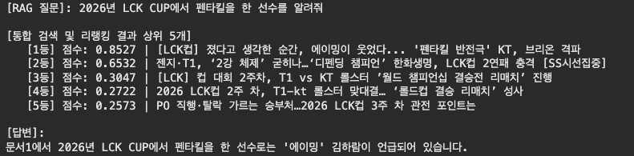

# 1. 문제 정의

실패 원인을 분석해보니 크게 두 가지였다.

### 1. 비정형 데이터(뉴스)의 한계
뉴스 기사는 줄글이다. "T1이 젠지를 상대로 2:0 승리를 거두며..." 같은 문장이 긴 텍스트 속에 파묻혀 있다. AI가 여기서 '날짜'와 '스코어', '팀명'을 정확히 매핑해서 가져오는 건 생각보다 어려운 일이다.

### 2. 벡터 검색(Vector Search)의 맹점
기존에 사용한 **Vector Search(Dense Retrieval)** 는 문장의 **'의미(Semantics)'**를 파악하는 데는 문제가 없다.
하지만 **"1월 23일"**, **"2대0"**, **"DRX"** 같은 **정확한 숫자나 고유명사(Keyword)** 를 찾는 것에 약하다. '경기 결과'라는 의미에 꽂혀서, 정작 내가 원하는 날짜가 아닌 다른 날짜의 '경기 결과 분석 칼럼'을 가져오는 현상이 발생한 것이다.

## 2. 해결책 1: 데이터 엔지니어링 

우선 정확한 경기 결과 전달을 위해 [네이버 e스포츠의 경기 결과표](https://game.naver.com/esports/League_of_Legends/schedule/lck?date=2026-01) 데이터를 크롤링했다.


### 1. JSON을 자연어로 변환
보통 크롤링한 JSON 데이터를 그대로 DB에 넣으려 한다. 하지만 LLM은 구조화된 데이터보다 **자연어 문장**을 훨씬 잘 이해한다. 그래서 파이썬 스크립트를 짜서 데이터를 문장으로 변환했다.

* **Before:** JSON 형태의 Key-Value 데이터
* **After:** "2026년 1월 23일 열린 T1 대 젠지의 경기 결과는 2:0으로 T1이 승리했습니다."와 같은 완전한 문장

이렇게 문장으로 만들어주면 검색될 확률(유사도)이 비약적으로 상승한다.

```python
match_info = {
    "date": match_date,
    "time": match_time,
    "team_a": team_a,
    "team_b": team_b,
    "score": full_score,
    "status": match_state,
    "description": f"{match_date}에 진행된 {team_a} 대 {team_b}의 경기는  {score_a}:{score_b} 스코어로 {match_state}되었습니다."
}
results.append(match_info)
                        
```

### 2. No Chunking 
뉴스 기사는 너무 길어서 잘랐지만, 이 경기 결과 데이터는 자르지 않고 **통째로 임베딩**했다.
만약 텍스트를 자르다가 "1월 23일"과 "T1 승리"가 다른 덩어리로 나뉘면, AI는 날짜와 승패를 연결 짓지 못한다. 짧고 명확한 정보는 **One Document = One Chunk** 로 유지하고자 했다.

---

## 3. 해결책 2: 검색 알고리즘 고도화 

그래서 이번 프로젝트의 핵심인 **앙상블 검색(Ensemble Search)** 과 **리랭킹(Re-ranking)** 파이프라인을 구축했다.


### 1. 앙상블 검색 (Vector + BM25)
기존에는 Vector DB에서만 5개를 가져왔지만, 이번에는 **후보군을 넓게 잡는 전략**을 취했다.

1.  **Vector Search (의미 검색):** 질문의 맥락과 유사한 문서 **10개**를 가져온다.
2.  **BM25 Search (키워드 검색):** 질문에 포함된 단어(예: '펜타킬', '1월 23일')가 정확히 박혀있는 문서 **10개**를 가져온다.
3.  **통합(Union):** 이 둘을 합쳐 총 **20개**의 넉넉한 예비 후보군을 만든다. (중복되는 문서는 제거한다.)

이렇게 하면 의미가 맞는 문서와 키워드가 맞는 문서를 모두 놓치지 않고 긁어모을 수 있다.

```python
vector_docs = vector_db.similarity_search(question, k=10)

    # BM25 검색
    all_data = vector_db.get() 
    bm25_docs = [Document(page_content=t, metadata=m)
                 for t, m in zip(all_data['documents'], all_data['metadatas'])]

    bm25_retriever = BM25Retriever.from_documents(bm25_docs)
    bm25_retriever.k = 10
    keyword_docs = bm25_retriever.invoke(question)

    # 결과 합치기 & 중복 제거
    combined_docs = vector_docs + keyword_docs

    unique_docs = {}
    for doc in combined_docs:
        unique_docs[doc.page_content] = doc # 중복 제거

    candidate_docs = list(unique_docs.values())

    if not candidate_docs:
        return []
```

### 2. 리랭킹 (Re-ranking)
20개나 되는 문서를 전부 LLM에게 주면 토큰 낭비고, 오히려 헷갈려한다. 여기서 **Cross-Encoder(리랭커)**를 도입해 진짜 정답을 가려낸다.

이게 왜 중요한지 이해하려면, 우리가 앞서 사용한 벡터 검색(Bi-Encoder)과의 차이를 알아야 한다.

#### 기존 벡터 검색 (Bi-Encoder)
* **작동 방식:** 질문과 문서를 각각 독립적인 벡터로 변환한 뒤, 두 벡터 사이의 거리(유사도)만 계산한다.
* **한계:** 질문과 문서 사이의 미묘한 문맥적 상호작용을 파악하지 못한다. 그래서 "관련 있어 보이는" 문서를 찾을 뿐, "정답인" 문서를 찾는 능력은 떨어진다.

#### 리랭킹 (Cross-Encoder)
* **작동 방식:** 코드에서 사용한 `BAAI/bge-reranker-v2-m3` 모델은 질문과 문서를 **하나의 쌍(Pair)**으로 묶어서 모델에 통째로 넣는다. 모델은 질문의 단어와 문서의 단어가 서로 어떻게 연결되는지(Attention)를 **처음부터 끝까지 정밀하게 분석**한다.
* **비유:** "1차 검색이 서류 전형으로 20명을 대충 뽑는 거라면, 리랭킹은 면접관이 심층 면접을 봐서 진짜 정답인 5명을 최종 선발하는 과정이다."
* **사용 모델** `reranker_model = CrossEncoder('BAAI/bge-reranker-v2-m3', ...)`

결과적으로 채점 점수가 가장 높은 **상위 5개**만 선별해서 LLM에게 넘겨준다.

```python
pairs = [[question, doc.page_content] for doc in candidate_docs]
scores = reranker_model.predict(pairs)

# 점수 높은 순 정렬
sorted_indices = np.argsort(scores)[::-1]

final_docs = []
print(f"\n[통합 검색 및 리랭킹 결과 상위 {k_final}개]")
    for i in range(min(k_final, len(candidate_docs))):
    idx = sorted_indices[i]
    doc = candidate_docs[idx]
    score = scores[idx]
    final_docs.append(doc)

    # 디버깅 출력
    title = doc.metadata.get('title', '제목없음')
    print(f"   [{i+1}등] 점수: {score:.4f} | {title}")
```

### 3-3. 프롬프트 엔지니어링 
마지막으로, `ask_smart_rag` 함수에서 시스템 프롬프트를 강력하게 걸어줬다.

> **[지침]**
> 1. 질문에 특정 날짜(예: 1월 23일)가 있다면, 문서 내의 '날짜' 정보와 정확히 대조하세요.
> 2. 경기 결과는 반드시 문서에 명시된 내용만 말하세요.
> 3. 정답이 없으면 솔직하게 "없다"고 답하세요.

```python
당신은 e스포츠 분석가입니다.
제공된 [문서]를 정밀하게 분석하여 질문에 답하세요.

[지침]
1. 질문에 특정 날짜(예: 1월 23일)가 있다면, 문서 내의 '날짜' 정보와 정확히 대조하세요.
2. 경기 결과(승패, 스코어)는 반드시 문서에 명시된 내용만 말하세요.
3. 문서에 정답이 없다면 솔직하게 "문서에 해당 날짜의 경기 정보가 없습니다"라고 답하세요.
```

---

## 4. 결과 (Before & After)

이 모든 과정을 거친 후, 똑같은 질문을 다시 던져봤다.

> 2026년 LCK CUP에서 펜타킬을 한 선수를 알려줘

**기존 대답**

> 문서5에 따르면, '에이밍’ 펜타킬을 한 선수는 KT의 선수입니다. 그러나 특정 선수의 이름은 문서에 명시되어 있지 않습니다.


**현재 대답**



---
