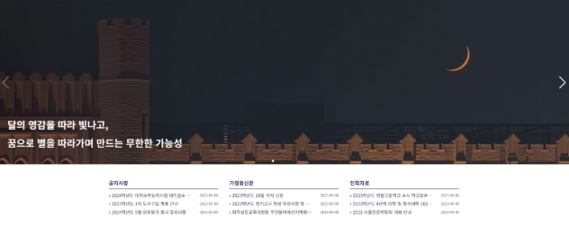
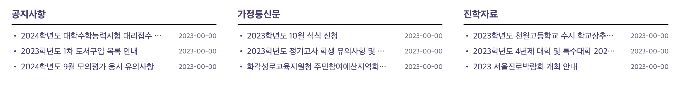
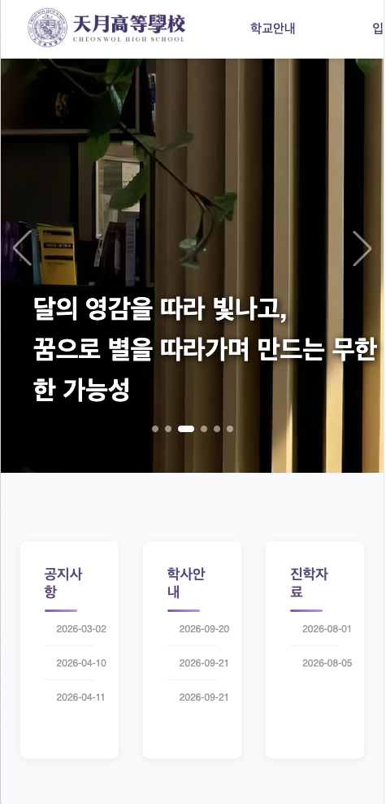
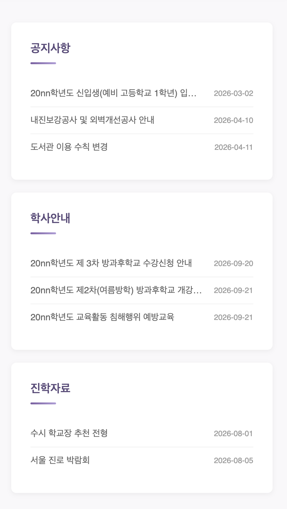
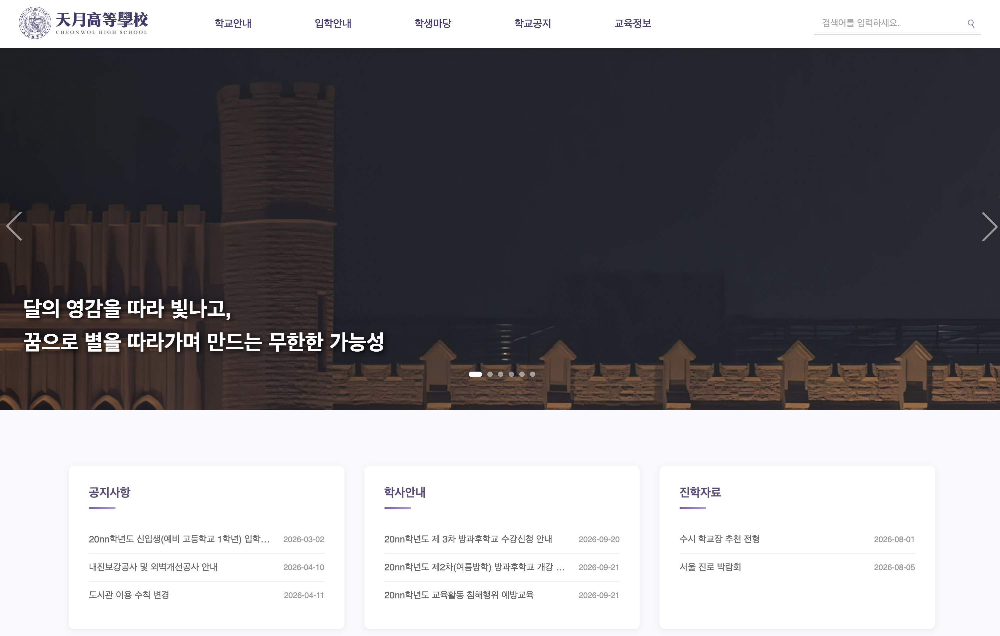

AI가 정말 많이 발전했지만... 나는 아직 스스로 코드를 칠 수 있는 능력이 필요하다고 생각한다. 특히 나처럼 배우는 단계인 사람들은 더더욱. 그래서 이번 프로젝트는 전반적으로 AI를 거의 활용하지 않고 진행중이다. 애용하던 코파일럿도 해지하고 스스로 생각하고 코드를 치려고 노력하고 있다. 

## Header 구조 수정

오늘은 우선, 어제 하기로 했던 Header부분의 구조 수정 먼저 해보았다. 먼저, 기존의 `Header.tsx`코드를 보면

```html
<li>
    <span className="info-study topmain">
        <Link to="#" className="menu-a">
            교육정보
        </Link>
    </span>
    <ul className="drop-down menu5">
        <li>
            <Link to="#" className="menu-a">
                진학자료
            </Link>
        </li>
        <li>
            <Link to="#" className="menu-a">
                진학상담
            </Link>
        </li>
    </ul>
</li>
```

이런 식으로 최상단에 위치하는 메뉴목록 하나, 드롭다운에 사용되는 메뉴 ul로 구성되었다. 지금은 드롭다운에 사용되는 메뉴가 두 개밖에 없어서 적어보이지만 최대 5개까지 들어가는 항목이 있기에 코드가 쓸데없이 길고, 불필요한 반복이 너무 많다. 

그래서 `map`을 활용해 조금 더 보기 깔끔하게 리팩토링해보았다. 우선 `type/index.ts`에 메뉴 드롭다운에 사용할 `HeaderMenu`를 정의해주었다.

```ts
export interface HeaderMenu {
  id: number;
  menu: string;
  toLink: string;
}
```

여기서 toLink는 리다이렉트 할 주소이다. 이렇게 interface를 정의하고, `Header.data.ts`에 각각 드롭다운 메뉴의 값을 정의해주었다.

```ts
export const EDU_NOTICE: HeaderMenu[] = [
    {
        id: 1,
        menu: "진학자료",
        toLink: "/"
    },
    {
        id: 2,
        menu: "진학상담",
        toLink: "/"
    }
]
```

어느 페이지까지 개발을 진행할지 모르는 일이기도 하고, 개발된 페이지가 없기에 toLink는 전부 `/`로 해주었다. 이를 바탕으로 아래와같이 구조를 수정했다.


```html
<ul className="drop-down menu3">
    {TO_STUDENT.map((props) => (
        <li key={props.id}>
            <Link
                to={props.toLink}
                onClick={handleRestrictedClick}
                className="menu-a"
            >{props.menu}</Link>
        </li>
    ))}
</ul>
```

사실 그닥 익숙한 문법은 아니어서 중간에 `{props.menu}`를 빼먹어서 drop down해도 메뉴가 안 나오거나, key를 지정해주지 않아서 제대로 나오지 않기도 했다. 


## Banner 제작

기존의 사이트를 보면, 이렇게 배너가 있다. 



오늘은 여기서 가장 크게 보이는 메인 배너(글자가 포함된 사진)와 아래 있는 공지사항 배너를 제작해보았다. 

### MainBanner

자세히 보면, 메인 배너는 swiper로 제작되었다. 옛날 코드에서도 이를 볼 수 있다. 

*기존 코드*
```html
<div class="swiper">
    <div class="swiper-wrapper">
        <div class="swiper-slide">
```

솔직히 너무 오래 전이라 사용법을 다 까먹기도 했고, 이때도 깊게 공부하지 않고 문서를 따라쳐서 어영부영 만든 것에 가까웠기에 이번 기회에 사용법을 자세히 찾아보며 작업했다. (이 내용은 추후 별도의 문서로 작성 예정)

메인 배너의 Swiper는 아래와같이 작성하였다. 

```html
<Swiper
    modules={[Navigation, Pagination, Autoplay]}
    spaceBetween={0}
    slidesPerView={1}
    navigation
    pagination={{ clickable: true }}
    autoplay={{ delay: 8000, disableOnInteraction: false }}
    loop={true}
    className="bannerSwiper"
>
```

핵심이 되는 속성만 빠르게 짚어보자면,

- `modules`: 사용할 기능을 조립
- `autoplay`: 자동 재생 설정
- `loop`: 무한 반복
- `sliderPerView`: 한 화면에 보일 개수

이다. 마찬가지로 BannerItem이라는 interface를 정의해서 map으로 구현했다. 여기서, BannerItem은 나중에도 사용될 수 있어서 `type/index.ts`에 정의를 했지만, 각 슬라이드 위에 올라가는 학교 교훈은 `Mainbanner.tsx`에서만 사용되기 때문에 따로 빼지 않고 한 파일에 정의했다. 

### PostBanner

다음으로, 포스트 배너이다. 옛날 코드에서 이 부분을 구현해야하는데 



원래는 데이터베이스에서 받아와야지만 아직 서버가 없기때문(옛날 사이트도 데이터베이스 따위는 없었다)에 interface를 만들어놓고 목 데이터로 작업을 진행했다.

포스트 배너는 각각 공지사항, 학사안내(이름을 바꾸었다), 진학자료 게시판의 최근 게시글 3개를 보여주는 역할이다. 우선 나중에 게시글을 받아올 때도 쓰일 Post interface를 `type/index.ts`에 다음과 같이 정의했다. 

```ts
export interface Post {
    id: number;
    title: string;
    date: string;
    link: string;
}
```

그리고 `PostBanner.tsx`에서만 쓰일 interface인 `MiniBoardProps`를 다음과 같이 정의했다.

```ts
interface MiniBoardProps {
  title: string;
  toLink: string;
  posts: Post[];
}
```

대략적인 동작흐름으로는, title, toLink, posts를 매개변수로 받아서 하나하나 출력하는 느낌이다. 따라서 우선 매개변수로 받을 수 있도록 설정을 해주고,

```ts
const PostBanner = ({ title, toLink, posts }: MiniBoardProps) => 
```

다음과 같이 map으로 화면에 띄웠다.

```html
<div className="sub-menu-header">
    <h3>
        <Link to={toLink}>{title}</Link>
    </h3>
    <span className="accent-line"></span>
</div>
    <div className="post-ul">
        <ul className="notice">
            {posts.map((post) => (
                <li key={post.id}>
                <Link to={post.link}>{post.title}</Link>
                <span className="date">{post.date}</span>
                </li>
            ))}
        </ul>
    </div>
</div>
```

앞서 Header의 구조를 변경했었는데, Header는 최상단의 값(교육정보, 학교공지 등...)은 직접 하드코딩으로 넣었지만, 포스트 배너는 타이틀 값까지도 변수로 받아와서 코드가 훨씬 깔끔해보인다. (나중에 Header의 구조 변경의 변경을 할 수도...)

또한 중요하게 생각했던 점이 반응형 디자인인데, 미디어 쿼리를 적용하여 창의 너비가 줄어도 깔끔하게 보이게끔 했다.

*미디어 쿼리 작성 전*



*미디어 쿼리 작성 후*

```css
@media screen and (max-width: 1024px) {
    
    .sub-menu {
        flex-direction: column;
        align-items: center;    
        gap: 20px;             
    }
    .sub-menu1 {
        width: 100%;      
        max-width: 600px; 
    }
}
```



## 현재 진행도



## 다음 과정

- 포토 배너
- 복습 꾸준히 하기!!