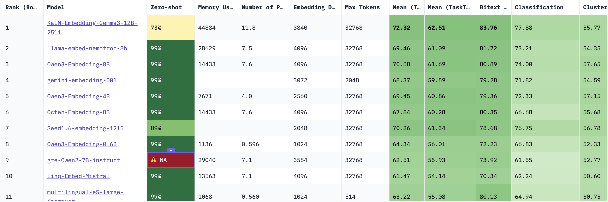

## 1. 임베딩(Embedding)

컴퓨터에게 "사과"라는 단어를 보여주면, 컴퓨터는 그저 'ㅅ', 'ㅏ', 'ㄱ', 'ㅘ'라는 문자의 조합으로만 인식한다. "맛있다"는 느낌이나 "과일"이라는 범주는 전혀 모른다. 그래서 우리는 컴퓨터가 이해할 수 있는 유일한 언어, 즉 **숫자**로 바꿔줘야 한다.

**임베딩(Embedding)** 이란, **사람의 언어(텍스트, 이미지 등)를 컴퓨터가 계산할 수 있는 '숫자들의 나열(벡터, Vector)'로 바꾸는 과정**이다.

#### 쉽게 비유하자면? 
단어를 지도 위에 점을 찍는다고 상상해보자.
* '강아지'와 '고양이'는 '반려동물'이라는 의미가 비슷하니까, 지도상에서 **아주 가까운 위치**에 점이 찍힌다.
* 반면, '강아지'와 '자동차'는 전혀 관계가 없으니 **아주 먼 곳**에 점이 찍힌다.

이렇게 단어나 문장을 좌표(숫자)로 바꿔서, **의미가 비슷한 것끼리 뭉치게 만드는 기술**이 바로 임베딩이다. 이 숫자의 묶음을 우리는 **벡터(Vector)** 라고 부른다.
 

## 2. 유사도 검색(Similarity Search)

임베딩을 통해 모든 데이터를 좌표로 바꿨다면, 이제 원하는 정보를 찾을 차례다. 여기서 등장하는 것이 **유사도 검색(Similarity Search)** 이다.

### 기존 검색(Keyword Search)과의 차이점
우리가 흔히 쓰는 검색엔진은 **키워드 검색**이다.
* **질문:** "배가 너무 아파요"
* **키워드 검색 결과:** "배"라는 글자가 들어간 '배(Ship) 만드는 법', '배(Pear) 가격' 등이 나온다. (정확도 낮음)

하지만 **유사도 검색**은 의미를 찾는다.
* **질문:** "배가 너무 아파요" (이 문장을 임베딩해서 좌표를 찍음)
* **유사도 검색 결과:** 좌표상에서 가장 가까운 문장을 찾았더니 "복통 완화 방법", "소화 불량 해결" 같은 글들이 나온다.

### 작동 원리
1.  사용자가 질문을 입력하면, 임베딩 모델이 이를 **숫자 좌표(벡터)** 로 변환한다.
2.  데이터베이스에 저장된 수만 개의 데이터 좌표 중, 질문의 좌표와 **거리가 가장 가까운** 데이터들을 찾아낸다.
3.  이것을 사용자에게 보여준다.

이때 '가깝다'는 것을 수학적으로 계산하기 위해 **코사인 유사도(Cosine Similarity)** 같은 공식을 사용하는데, 쉽게 말해 **"방향과 위치가 얼마나 겹치느냐"** 를 따지는 것이다.

 

## 3. MTEB

이제 임베딩이 뭔지 알았다. 그런데 세상에는 구글, 오픈AI, 메타 등 수많은 회사들이 만든 임베딩 모델이 존재한다. **"과연 누구의 모델이 가장 한국어를 잘 이해할까?"** 혹은 **"검색은 누가 제일 잘할까?"**

이걸 공정하게 평가하기 위해 만든 것이 바로 [**MTEB(Massive Text Embedding Benchmark)**](https://huggingface.co/spaces/mteb/leaderboard)다.

### MTEB가 중요한 이유
MTEB는 단순히 "비슷한 단어 찾기"만 시키지 않고, 여러 분야를 테스트한다.

총 9가지 영역, 100개가 넘는 언어로 시험을 치른다. 최근 발표된 **MTEB v2**는 특히 전 세계 언어(Multilingual) 능력을 중요하게 본다.

#### 컬럼 분석

MTEB의 순위표를 보면 이렇게 모델 이름과 랭킹, 그리고 모델의 성능과 태스크 점수 등을 나타내는 컬럼이 정말 많다. 

**모델 스팩 관련**

- `Rank(Borda)` : 단순 평균 점수 순위가 아닌, 투표 시스템(Borda Count)을 사용하여, 어느 한 분야만 잘하는 모델보다 모든 분야에서 골고루 상위권인 모델이 더 높은 등수를 받는다.
- `Memory Usage` : 이 모델을 돌리기 위해 필요한 VRAM의 용량
- `Number of Parameters (B)`: 모델의 지능 용량이다. `B`는 Billion을 뜻하며, 클 수록 모델이 똑똑하지만 속도가 느리다.
- `Max Tokens`: 한 번에 읽을 수 있는 글자 수
- `Embedding Dismensions`: 입력 테스트가 변환되는 벡터 공간의 차원 수, 차원이 높을수록 더 많은 정보를 담을 수 있지만 계산 비용이 선형적으로 증가한다.

**테스트 분야 관련**

- `Mean(Task)`: 종합 평균 점수(GPA)이다. 전체적인 AI의 지능 수준을 보여준다.
  - `Mean (Task Type)`: 9가지의 태스트 유형별 점수를 먼저 낸 뒤, 그 유형 점수들의 평균을 다시 낸 값이다.
- `Bitext Mining`: 이중 언어 마이닝, 두 언어의 문장 집합에서 서로 번역 관계인 문장 쌍을 찾는 태스크이다.
  - 이 점수가 높으면 다국어 번역 및 검색 성능이 우수함을 의미함 
- `Retrieval`: 주어진 쿼리 벡터와 가장 유사도가 높은 문서 벡터들을 찾아냈을 때, 정답 문서가 상위 K개 안에 포함되어 있는지를 평가
- `STS (Semantic Textual Similarity)`: 말만 다르고 뜻은 같은 문장을 알아보는 능력
- `Classification`: 임베딩 벡터를 입력으로 받아 간단한 분류기 학습을 시켰을 때의 정확도를 측정
  - 임베딩 공간에서 데이터의 클래스가 선형적으로 얼마나 잘 분리되는지를 평가
- `instruction Reranking`: 쿼리에 특정 지시허가 포함되어있을 때, 모델이 그 의도에 맞춰 검색 결과의 순위를 변경하는 능력
  - 고정된 의미 유사도가 아니라, 사용자 의도에 따라 동적으로 벡터를 조정하는 능력을 평가한다. 점수가 낮은 모델은 지시어를 무시하기도 한다.
- `Multilabel Classification`: 하나의 텍스트가 여러 개의 클래스에 속할 수 있는 경우를 분류하는 성능이다.
  - 단일 분류보다 더 복잡한 의미 관계를 파악해야 하므로, 모델의 세밀한 특징 추출 능력을 평가한다.
- `Pair Classification`: 두 문장이 주어졌을 때, 이들이 문맥적으로 같은 의미인지 아닌지를 분류
  - STS와 비슷하지만, 여기서는 같다/다르다의 명확한 경계를 잘 설정하는지를 평가한다.
- `Reranking`: 1차로 검색된 문서 리스트를 입력받아, 쿼리와의 관련성 점수를 다시 계산하여 순위를 재정렬한 후 MAP등을 측정한다.
  - 단순 코사인 유사도 검색의 한계를 보완하여, 정밀한 검색 정확도를 얼마나 높일 수 있는지 평가한다.
  

#### 다른 사람들이 모델을 평가할 때 가장 중요하게 보는 지표를 보자면,

1.  **MTEB (Massive Text Embedding Benchmark):**
    * 현재 전 세계 공통 평가표.

2.  **NDCG@10 (Normalized Discounted Cumulative Gain):**
    * 검색 엔진 성능 평가의 표준.
    * "상위 10개 결과 안에 정답이 얼마나 잘 포함되어 있는가?"를 수치화한 것.
    * 주요 논문들에서 모델 성능을 보여줄 때 Accuracy 대신 이 지표를 씀.

3.  **Latency vs Accuracy Trade-off:**
    * 아무리 성능이 좋아도(Accuracy), 응답 속도(Latency)가 느리면 못 쓴다.
    * 최근 트렌드는 **"Qwen3-0.6B처럼 작지만 성능 좋은 모델"** 을 사용하여 속도와 정확도를 모두 잡는 것이다.

## 4. 업계 및 학계에서 사용하는 모델
현재 임베딩 모델 시장은 **편의성을 중시하는 '상용 API'** 와 **성능 및 보안을 중시하는 '오픈소스'** 로 나뉜다.

#### 기업
기업에서는 유지보수 비용을 줄이고 검증된 성능을 얻기 위해 유료 API를 주로 사용한다.

| 모델명                     | 개발사    | 사용 이유 및 특징                                                                       |
| :------------------------- | :-------- | :-------------------------------------------------------------------------------------- |
| **text-embedding-3-large** | OpenAI    | 가장 많이 쓰이는 베이스라인. 다국어 성능이 준수하고 레퍼런스가 가장 많음.               |
| **Cohere-embed-v3**        | Cohere    | RAG 구축 시 'Rerank(재순위화)' 기능을 함께 제공하여 검색 정확도가 매우 높음.            |
| **Voyage-3-large**         | Voyage AI | 스탠포드 연구진이 만든 모델로, 특정 도메인(법률, 금융)에서 OpenAI보다 높은 성능을 보임. |

#### 학계

최신 논문이나 연구 프로젝트에서는 커스터마이징이 가능하고 최신 기법이 적용된 오픈소스 모델을 선호한다.

| 모델명              | 개발사    | 관련 논문/리포트        | 핵심 트렌드                                                         |
| :------------------ | :-------- | :---------------------- | :------------------------------------------------------------------ |
| **Qwen3-Embedding** | Alibaba   | *Qwen Technical Report* | 2026년 기준 MTEB 리더보드 최상위권. 한국어 포함 다국어 성능 압도적. |
| **BGE-M3**          | BAAI      | *BGE-M3 Paper*          | Dense(유사도) + Sparse(키워드) 검색을 모델 하나로 동시에 수행 가능. |
| **E5-mistral-7b**   | Microsoft | *E5 Paper*              | 거대언어모델(LLM)을 임베딩용으로 튜닝하여 추론 능력을 극대화함.     |

- `SOTA(State-of-the-Art)`: 현재 시점에서 특정 기술 분야의 최고 성능 수준을 의미한다.

### 관련 논문 및 기술 리포트

#### 다기능/다국어 임베딩의 표준
* **제목:** [*BGE M3-Embedding: Multi-Lingual, Multi-Functionality, Multi-Granularity Text Embeddings Through Self-Knowledge Distillation* (2024)](https://arxiv.org/abs/2402.03216)
* **내용:** 단순히 유사도만 보는 것이 아니라, **Dense(벡터) + Sparse(키워드) + Multi-vector(다중표현)** 세 가지 방식을 결합했을 때 검색 성능이 비약적으로 상승함을 증명함.

#### "지시어(Instruction)"가 검색 품질을 바꾼다
* **제목:** [*Text Embeddings by Weakly-Supervised Contrastive Pre-training* (2022/2024 updated)](https://arxiv.org/abs/2212.03533)
* **내용:** 질문 앞에 "Query: ", 문서 앞에 "Passage: " 같은 **접두어(Instruction)** 를 붙여서 학습시켰더니 성능이 대폭 향상됨을 입증한 논문.

#### 최신 검색 증강 생성 트렌드
* **제목:** [*Retrieval-Augmented Generation for Large Language Models: A Survey*](https://arxiv.org/pdf/2402.19473) (2024)
* **내용:** RAG 파이프라인에서 '임베딩 모델'이 차지하는 중요성과, 최근 연구들이 **Fine-tuning**된 임베딩 모델을 사용하여 성능을 높이는 방법을 소개함.

### 5. 모델 선정

위 내용에 따라 가장 적합한 3가지 모델을 선정해 보았다.

### Qwen3-Embedding-8B (Rank 3)

* **기본 스펙:** 8B 파라미터 / 14,433MB 메모리 / 32k Context
* **성능 지표:**
    * **종합 점수(Mean):** 70.58 (전체 3위)
    * **검색(Retrieval):** 70.88
    * **유사도(STS):** 81.08
* **선정 근거:**
    1.  **하드웨어 요구사항:** 1위 모델(KaLM)이 45GB 메모리를 요구하는 반면, 이 모델은 **14GB** 수준으로 일반적인 고성능 GPU 1장에서 여유롭게 구동된다.
    2.  **검증된 성능:** 검색 점수가 1위 모델과 비교해도 크게 뒤처지지 않으며, 종합 순위 3위로 모든 태스크(분류, 군집화 등)에서 안정적인 성능을 보여준다.
    3.  **한국어 강점:** Qwen 시리즈는 다국어 데이터셋으로 방대하게 학습되어 있어 한국어 처리 능력이 오픈소스 모델 중 최상위권이다.

### Octen-Embedding-8B (Rank 6)

* **기본 스펙:** 8B 파라미터 / 14,433MB 메모리 / 32k Context
* **성능 지표:**
    * **종합 점수(Mean):** 67.84 (전체 6위)
    * **검색(Retrieval):** **71.61** (Qwen3-8B보다 높음)
    * **유사도(STS):** **81.27** (최상위권)
* **선정 근거:**
    1.  **검색 특화:** 종합 순위는 6위로 조금 낮지만, RAG의 핵심인 **Retrieval 점수는 3위 모델보다 더 높다.**
    2.  **목적 적합성:** 분류(Classification)나 재순위화(Reranking) 같은 부가 기능보다, **'문서 찾기'** 그 자체에 집중하는 프로젝트라면 이 모델이 더 나은 결과를 줄 수 있다.

### Qwen3-Embedding-0.6B (Rank 8)

* **기본 스펙:** 0.6B 파라미터 / **1,136MB 메모리** / 32k Context
* **성능 지표:**
    * **종합 점수(Mean):** 64.34
    * **검색(Retrieval):** 64.65
* **선정 근거:**
    1.  **압도적 가벼움:** 메모리를 단 **1GB**만 차지한다. GPU가 없는 노트북이나 라즈베리 파이 같은 환경에서도 32k 긴 문맥 처리가 가능하다.
    2.  **가성비:** 파라미터 수가 10배 이상 차이 나는 거대 모델들과 비교해도 종합 순위 8위를 기록할 만큼 효율이 좋다. 초기 개발 단계에서 파이프라인을 빠르게 테스트할 때 유용하다.

---

### 기타 주목할 만한 모델 

선정되지는 않았지만, 특정 상황(고성능 서버 보유 등)에서 고려해볼 만한 모델들이다.

### KaLM-Embedding-Gemma3-12B (Rank 1)
* **특징:** 구글의 Gemma 3를 기반으로 한 현재 MTEB 리더보드 **1위** 모델이다.
* **장점:** 검색(75.66), 분류(83.76) 등 거의 모든 지표에서 압도적인 1등이다. 
* **단점:** **메모리를 약 45GB 사용**한다. 

### llama-embed-nemotron-8b (Rank 2)
* **특징:** NVIDIA가 Llama 모델을 기반으로 튜닝한 모델이다.
* **장점:** 종합 2위로 매우 우수하며, 기업용 AI 인프라에 최적화되어 있다.
* **비고:** 메모리 사용량이 약 28GB

### gemini-embedding-001 (Rank 4)
* **특징:** Google의 API 기반 모델이다.
* **장점:** 별도의 서버 구축 없이 API 호출만으로 상위권 성능을 낼 수 있다.
* **단점:** Context Length가 **2,048 토큰**으로 매우 짧다. 긴 문서를 처리하려면 복잡한 청킹(Chunking)이 필요하다.
