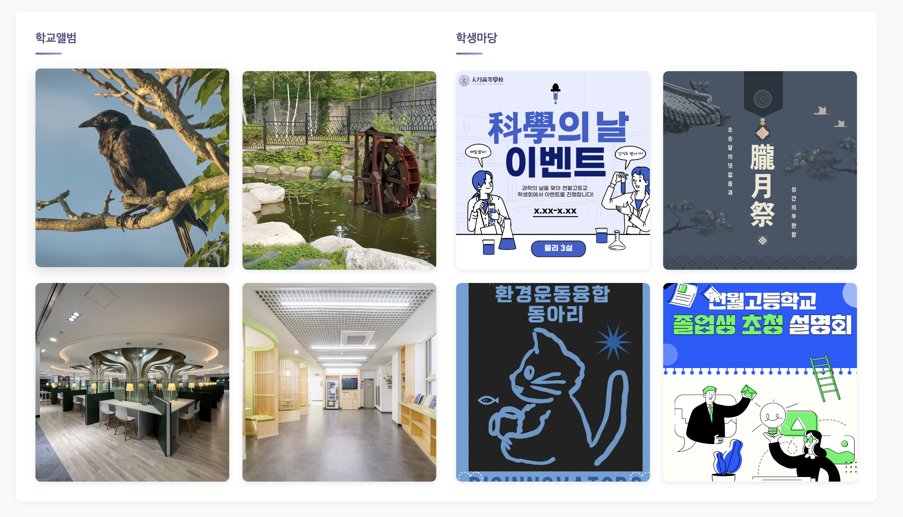
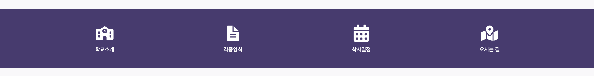
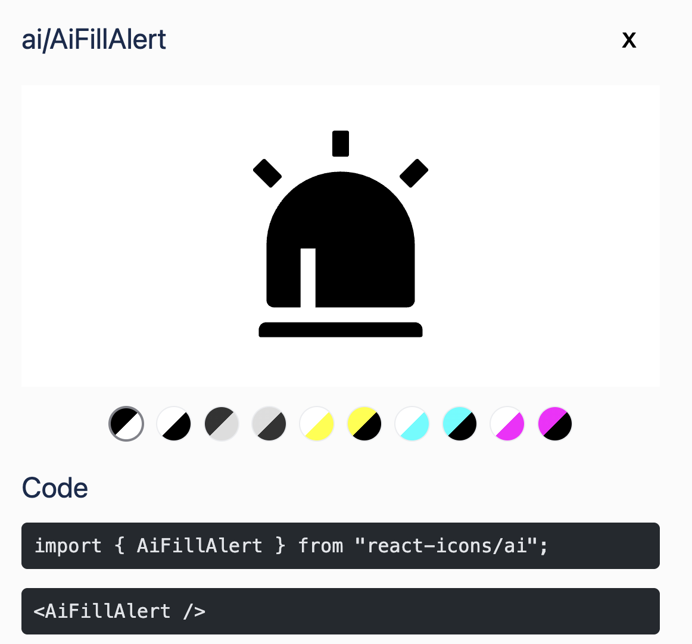
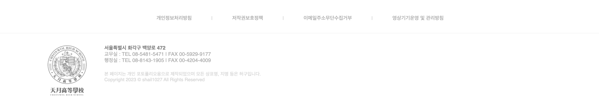

## 메인페이지 완성

드디어 메인 페이지를 마무리했다. 메인 페이지는 크게 헤더, 메인베너, 포토배너, 포스트 배너, 퀵메뉴, 푸터로 구성되어 있다. 헤더는 지난 포스트에서 리팩토링한 부분을 적용했고, 메인베너는 Swiper를 활용해서 만들었다. 포스트 배너랑 포토 배너는 아직 API가 없기에 더미데이터로 만들어보았다. 


## 포토 배너

지난 포스팅에 이어 포토 배너부터 설명해보자면, 포토 배너는 `PhotoBanner.tsx`로 만들어보았다. 포토 배너는 크게 카테고리와 포토 리스트로 구성되어 있다. 아직 API가 없기에 `Home.tsx`에서 더미데이터를 받아오는 식으로 만들었다. 여기에 띄워지는 이미지들은 기본적으로 Post로 정의되어있고, 아래와 같이 정의되어있는 `PhotoBannerProps`를 받아서 렌더링하는 식으로 만들어보았다.

```ts
interface PhotoBannerProps {
  section_category: string;
  section_link: string;
  posts: Post[];
}
```

가장 고민되었던 부분은 레이아웃 구성이었다. 포토 배너는 아래와 같이 왼쪽의 섹션 헤더와 사진들, 오른쪽의 섹션 헤더와 사진들로 구성되어 있다. 




그래서 처음에는 PhotoBannerLeft, Right 이런 식으로 컴포넌트를 나누거나, 파일 하나에 두 개의 컴포넌트를 만들려고 했는데, 그렇게 하면 코드가 너무 길어지고, 중복되는 부분이 많아질 것 같았다. 또한, 컴포넌트 이름에 `Left`나 `Right`를 붙이는 것도 적절하지 않다고 생각했다. 그래서 하나의 컴포넌트로 만들고, `Home.tsx`에서 두 번 호출하는 식으로 만들어보았다.

```ts
 <div className={styles["photo-banner"]}>
    <PhotoBanner
        section_category="학교앨범"
        section_link="./school-album"
        posts={SCHOOL_ALBUM}
    />
    <PhotoBanner
        section_category="학생마당"
        section_link="./student-event"
        posts={STUDENT_EVENT}
/>
</div>
```

### 트러블 슈팅

난 기존에 CSS를 그냥 import로 불러와서 사용을 했는데, 이렇게 사용하니 다음과 같은 문제가 발생했다. 구분선에 대한 CSS인 `accent-line`이 같은 className으로 PhotoBanner랑 PhostBanner에서 사용되고 있었다. 나는 당연히 CSS가 지역 할당이 되어서 각각의 컴포넌트에서 다른 스타일이 적용될 줄 알았는데, import 한 적이 없는 PhotoBanner의 accent-line에 CSS가 적용되고 있었다. 그래서 이와 관련해서 찾아보니, 기본적으로 React에서는 CSS import가 전역으로 적용되는 것을 알게되었다. 

**React가 CSS를 랜더링하는 방식**

1. 앱이 실행되면 Webpack이나 Vite 같은 번들러가 모든 CSS 파일을 긁어온다.
2. 모아온 CSS를 HTML의 `<head>`에 `<style>` 태그로 삽입한다.
3. 브라우저 입장에서는 이 CSS가 어디서 왔는지 모르고, 이렇게 삽입된 CSS는 전역적으로 적용된다. 즉, 어떤 컴포넌트에서 import한 CSS든 상관없이 모든 컴포넌트에 영향을 미친다.

그래서 이를 해결하기 위해 CSS Module을 사용하기로 했다. CSS Module은 CSS 파일을 모듈화해서, 각 컴포넌트에서 import한 CSS가 해당 컴포넌트에만 적용되도록 해준다. CSS Module을 사용하려면, CSS 파일 이름을 `ComponentName.module.css`로 바꿔주고, 컴포넌트에서 import할 때도 다음과 같이 변경해주면 된다.

```ts
import styles from './PostBanner.module.css'; 

const PostBanner = () => {
  return (
    <div className={styles.container}> 
       <span className={styles['accent-line']}></span> // 하이픈이 있는 경우에는 대괄호로 감싸기
    </div>
  );
};
```

이렇게 하면, 실제 브라우저에서는 `PostBanner_accent-line__abc123`와 같이 고유한 클래스 이름으로 변환되어 적용되기 때문에, 다른 컴포넌트에서 같은 클래스 이름을 사용하더라도 충돌이 발생하지 않는다.


## 퀵 메뉴

다음으로는, 퀵 메뉴이다. 아래와 같이 구성되어 있으며, `QuickMenu.tsx`로 만들어보았다. 퀵 메뉴는 크게 아이콘과 텍스트로 구성되어 있다. 기존 코드에서는 아이콘을 직접 저장하고 불러오는 방식으로 만들었는데, 이러면 아이콘이 많아질 수록 관리도 어렵고 유지보수도 어려워질 것 같아서 [React Icons](https://react-icons.github.io/react-icons/) 라이브러리를 사용해 보았다.

 

React Icons는 다양한 아이콘 라이브러리를 React 컴포넌트로 사용할 수 있게 해주는 라이브러리이다. 

*설치*
```bash
npm install react-icons
```

설치 후에는 다음과 같이 `` 태그처럼 아이콘을 import해서 사용할 수 있다. 

```ts
import { FaHome } from 'react-icons/fa';

...
<FaHome size={24} color="#333" /> // 아이콘 컴포넌트는 size와 color 같은 props를 지원한다.
```

공식 사이트에 이런 식으로 친절하게 import법, 사용법이 적혀 있다.

 


그래서 우선 `QuickMenuList`라는 interface를 아래와 같이 정의했다.

```ts
interface QuickMenuList {
  id: number;
  name: string;
  icon: string;
  linkto: string;
}
```

아이콘 이름을 string으로 받아서 <{props.icon} /> 이런 식으로 사용하려고 했다. 하지만, 이렇게 하면 오류가 발생했다. 오류의 원인을 찾아보니 React에서는 JSX 태그 이름 자리에는 중괄호를 직접적으로 사용할 수 없기 때문이었다. JSX에서는 태그 이름이 대문자로 시작하는 경우에는 해당 이름이 컴포넌트로 인식되고, 소문자로 시작하는 경우에는 HTML 태그로 인식된다. 그래서 props.icon이 string으로 전달되면, React는 이를 HTML 태그로 인식하려고 시도하지만, 존재하지 않는 태그이기 때문에 오류가 발생하는 것이다. 

그래서 이를 해결하기 위해 아래와 같이 Icon 변수에 props.icon을 할당한 후, JSX에서 <Icon />으로 사용하도록 변경했다. 

```ts
const Icon = props.icon;
```

하지만 이렇게 해도 문제가 또 일어났다. 이유는, 내가 icon을 정의할 때 타입을 string으로 정의했기 때문이다. `icon: "FaSchool"` 이런 식으로 따옴표를 사용하면, React는 이를 아이콘이 아니라 그냥 "FaSchool"이라는 문자열로 인식해버린다. 그래서 `<FaSchool />`이 아닌 `<"FaSchool" />` 형태가 되어버려 아무것도 렌더링되지 않는 것이다. 그러므로 icon의 타입을 string이 아니라 React 컴포넌트로 정의해야 한다. React Icons에서 제공하는 아이콘들은 모두 React 컴포넌트이므로, icon의 타입을 `React.ComponentType`으로 정의하면 된다. 이렇게 하면, icon이 실제로 React 컴포넌트로 전달되어 `<Icon />` 형태로 렌더링될 수 있다.

```ts
icon: React.ElementType;
```

```ts
{
    id: 3,
    name: "학사일정",
    icon: FaCalendarAlt, // 따옴표 없이 작성
    linkto: "#",
},
```

```ts
<Icon className={styles["list-image"]} /> // Icon 컴포넌트로 사용
```

`React.ElementType`은 React에서 사용할 수 있는 모든 컴포넌트 타입을 나타내는 타입니다. 한마디로 React 컴포넌트 그 자체를 가리키는 타입이라 할 수 있다. JSX에서 `<MyComponent />`처럼 태그 자리에 쓸 수 있는 모든 것들을 포함한다. 여기에는 일반적인 함수형/클래스형 컴포넌트뿐만 아니라 `div`, `span` 같은 HTML 태그도 포함된다. 


## 푸터

마지막으로, 푸터는 `Footer.tsx`로 만들어보았다. 

 

푸터는 위와 같이 약관 및 정책 부분이랑 학교 정보 부분으로 나뉘어져 있다. 약관 및 정책 부분은 링크로 연결되어 있고, 학교 정보 부분은 텍스트로만 구성되어 있다. 푸터는 헤더와 마찬가지로 모든 페이지에서 공통적으로 사용되기 때문에, `layout`에 정의하고, `App.tsx`에서 import해서 사용하도록 했다. 푸터의 약관 및 정책 부분은 FooterLink이라는 interface로 정의했고, 학교 정보 부분은 하드코딩으로 진행했다.

```ts
interface FooterLink {
  id: number;
  linkto: string;
  name: string;
}
```

여기서, 약관 부분은 각각의 p태그 사이에 |라는 구분선?이 들어가있다. 기존 코드에서는 아래와 같이 divider을 span태그로 따로 뒀는데, 이러면 CSS에서 스타일링을 하기도 힘들고, 무엇보다 map을 두 번 돌려야 하는 등 코드가 너무 길어지는 문제가 있었다. 

*기존 코드*
```html
<a href="#">개인정보처리방침</a>
<span class="divider">|</span>
<a href="#">저작권보호정책</a>
<span class="divider">|</span>
```

그래서 CSS의 선택자를 사용해서 마지막 요소를 제외한 모든 요소 뒤에 |를 넣는 식으로 만들어보았다. 개인적으로 CSS의 이런 선택자 기능을 처음 알아서 신기했다.

```css
.linkto:not(:last-child)::after{
    content: "|";
    margin-left: 50px;
    color: lightgray;
    font-size: 13px;
}
```

- `:not(:last-child)`: linkto 클래스 중에서 마지막 요소를 제외한 모든 요소를 선택하는 선택자이다. 즉, linkto 클래스가 적용된 요소들 중에서 마지막 요소를 제외한 나머지 요소들을 선택한다.
- `::after`: 선택된 요소의 뒤에 가상 요소를 생성하는 선택자이다. 이 가상 요소는 실제로 DOM에 존재하지 않지만, CSS로 스타일링할 수 있다.
- `content: "|";`: 가상 요소의 콘텐츠로 |를 설정한다. 이렇게 하면 선택된 요소들 뒤에 |가 자동으로 추가된다.

마지막으로 맨 아래의 학교 로고와 주소, 전화번호 부분은 flex로 간단하게 만들었다. 사이트에도 명시되어있듯, **해당 페이지는 오직 포토폴리오용으로 제작되었으며, 모든 정보(전화번호, 주소, 로고 등)는 허구**임을 다시 한 번 명시한다. 


## 메인페이지를 마치며...

원래 맨 처음에는 React를 제대로 공부해보자! 라는 느낌으로 시작한 프로젝트였는데, 점점 내 진로와 맞게 풀스택로 만들어보고 싶다는 생각이 들어서, 프론트엔드 뿐만 아니라 백엔드도 같이 공부하면서 만들고 있다. 보통 프로젝트를 진행할 때에도 API가 먼저 만들어지고 프론트 작업을 하는 게 더 편하기에... 우선 메인 페이지까지만 만들고 나머지 페이지들은 서버 구축 후 API가 만들어지면 작업을 하려고 한다.

우선 개발 범위를 정해보려 한다. 학교 사이트이기에 API가 필요없는 단순 정보 페이지들도 있어서 쓸데없는 리소스가 들어갈 것 같아 API가 필요한 페이지들만 우선적으로 작업을 하려고 한다. 정적 정보 페이지 전체는 다음으로 미루고(학교 소개, 교육 목표, 학교 연혁 등...), API가 필요한 페이지들이랑 중요한 부분을 추려보았다.

1. 권한 기반 인증 시스템
- 학교 사이트이니 학생과 교직원의 권한 분리 필수
2. 게시판 CRUD
- 학교 공지사항, 교육 정보, 학생 마당 등 게시판 기능 구현
- 게시글 작성, 수정, 삭제 기능
- 게시글 목록 조회 및 상세 조회 기능
- 게시글 검색 기능
- 댓글 기능
3. 외부 데이터 API 연동
- 급식 메뉴, 학사 일정 등 외부 데이터 연동
4. 챗봇 기능
- 개인적으로 RAG 기반 챗봇 만들어보고 싶어서 챗봇 기능도 넣어보려고 한다.


이제 이를 기반으로 ERD 설계 및 서버 로직 구상에 들어가보려고 한다. 서버 공부 파이팅!!


## 다음 과정

- 서버 구축해보기
- ERD 설계 및 API 명세 작성