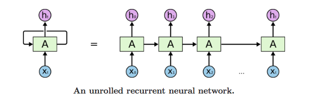
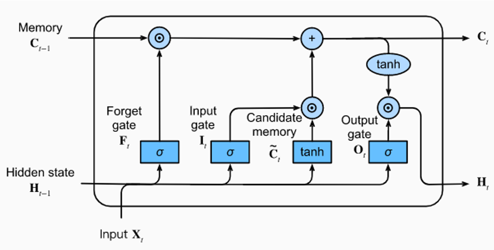
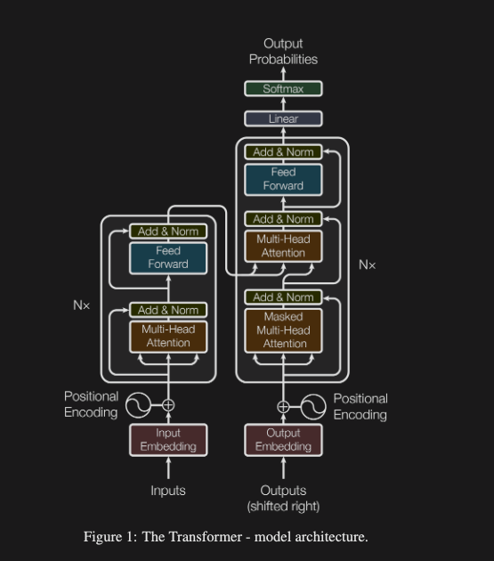
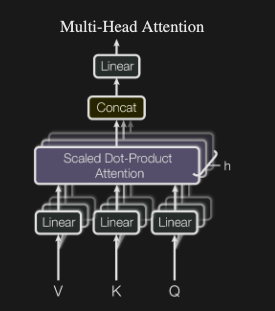

"Attention Is All You Need" 논문은 이전까지 자연어처리의 절대적인 공식이었던 순환 구조를 버리고, 오직 어텐션(Attention) 메커니즘만으로 돌아가는 모델을 처음 선보였다. 우리가 사용하는 ChatGPT의 T가 바로 이 Transformer이다. GPT, BERT, Llama 등 현재 존재하는 사실상 모든 대형 언어 모델과 비전 모델(ViT)은 모두 이 논문의 아키텍처를 뼈대로 삼고 있다. 그래서 AI에 대해 공부하기 위해서는 한 번쯤은 봐야하는 논문이라 생각한다.

## 1. Introduction 서론

- 당시 시퀀스 모델링 및 변환 문제에서는 RNN, LSTM, GRU가 표준으로 자리잡고 있었음.
- 기존 모델의 한계
  - RNN은 문장을 읽을 때 단어를 순서대로 계산해야 함.
  - $$t$$번째 단어의 Hidden State(은닉 상태) $$h_{t-1}$$를 구하려면 반드시 이전 단계인 $$h_{t-1}$$의 계산이 끝나야 함.
  - 이러한 본질적인 순차적(Sequential) 특성 때문에 훈련 과정에서 병렬화(Parallelization)가 불가능하다는 단점.
  - 문장(시퀀스)의 길이가 길어지면 메모리 제약이 발생하고, 멀리 떨어진 단어 간의 연관성을 파악하기가 어려워짐.
- 이전에도 어텐션 매커니즘은 존재했으나, 주로 RNN 계열 모델의 성능을 끌어올리기 위해 보조적으로 사용됨. (입력과 출력 사이의 거리에 상관 없이 의존성을 모델링하기 위해)
- **논문의 핵심 아이디어**
    > In this work we propose the Transformer, a model architecture eschewing recurrence and insteadrelying entirely on an attention mechanism to draw global dependencies between input and output.

    > 본 연구에서는 순환을 피하고 대신 입력과 출력 간의 전역 종속성을 파악하기 위해 전적으로 어텐션 메커니즘에 의존하는 모델 아키텍처인 Transformer를 제안합니다.

이 서론을 제대로 이해하기 위해서는, 당시 표준으로 사용되던 Sequence 모델들과 그 한계를 알아야한다. 다음은 문장이나 시계열 데이터처럼 순서가 있는 데이터를 처리하기 위해 사용되던 모델들이다.

### 1. RNN (Recurrent Neural Network)

- RNN은 과거의 정보를 현재로 전달하는 순환 구조를 가진다.
  - "나는 밥을 [먹는다]"를 예측할 때, 앞은 "나는"과 "밥을"의 상태(Hidden State)를 기억해 순차적으로 다음 단계로 전달한다.
  - Hidden State(은닉 상태)는 RNN이 시퀀스 데이터를 처리할 때, 이전 단계의 정보를 담고 있는 벡터이다.
- **RNN의 단점**
    - 장기 의존성 문제: 문장이 조금만 길어져도 앞부분의 정보가 뒤로 전달되면서 희석되어, 멀리 떨어진 단어 간의 연관성을 파악하기 어려움.
    - 병렬화 불가능: RNN은 시퀀스의 각 단계가 이전 단계의 계산이 끝나야 다음 단계로 넘어갈 수 있기 때문에, 훈련 과정에서 병렬 처리가 불가능함.

### 2. LSTM (Long Short-Term Memory)

- LSTM은 RNN의 장기 의존성 문제를 해결하기 위해 고안된 모델로, 내부에 정보를 얼마나 잊을지, 얼마나 기억할지 결정하는 "게이트(Gate)"와 "셀 상태(Cell State)"라는 개념을 도입해 기억을 훨씬 길게 유지한다.
  - Gate(게이트): 입력 게이트, 출력 게이트, 망각 게이트로 구성되어, 정보를 얼마나 기억할지 조절한다.
  - Cell State(셀 상태): 시퀀스 전체에 걸쳐 정보를 전달하는 벡터로, 게이트를 통해 정보가 추가되거나 제거된다.
- LSTM도 RNN과 마찬가지로 순차적 구조를 가지고 있어 병렬화가 불가능함.

### 3. GRU (Gated Recurrent Unit)

- GRU는 LSTM의 간소화된 버전으로, LSTM보다 적은 수의 게이트(업데이트 게이트와 리셋 게이트)를 사용하여 비슷한 성능을 낸다.
  - Update Gate(업데이트 게이트): 현재 상태를 얼마나 업데이트할지 결정한다.
  - Reset Gate(리셋 게이트): 과거 정보를 얼마나 무시할지 결정한다.

이렇듯 LSTM과 GRU가 RNN의 기억력 문제를 어느정도 해결했지만, 이 논문은 RNN 계열 모델이 가지는 구조적 결함을 지적했다. 

RNN계열 모델은 아무리 개선되어도 $$t$번째 단어의 Hidden State(은닉 상태) $h_{t-1}$를 구하려면 반드시 이전 단계인 $h_{t-1}$의 계산이 끝나야 하는 순차적 구조를 가지고 있다. 따라서 병렬화가 불가능하고, 시퀀스가 길어질수록 멀리 떨어진 단어 간의 연관성을 파악하기 어려워진다는 것이다. 이에 저자는 순차적으로 데이터를 처리하는 구조를 빼버리고 단어와 단어 사이의 연관성을 찾는 데는 Attention Mechanism 하나면 충분하다고 주장한다. 문맥 파악을 이해 문장을 처음부터 끝까지 읽는 대신, 입력된 모든 단어들을 벡터 공간에 찍어놓고, 서로간의 유사도를 한 번의 거대한 행렬 곱으로 계산해 버리겠다는 것이 Transformer의 핵심 아이디어이다.

## 2. Model Architecture 모델 아키텍처

Transformer는 크게 인코더(Encoder)와 디코더(Decoder)로 나뉜다. 

> The Transformer follows this overall architecture using stacked self-attention and point-wise, fullyconnected layers for both the encoder and decoder, shown in the left and right halves of Figure 1,respectively.

> 트랜스포머는 인코더와 디코더 모두에 대해 스택된 셀프 어텐션과 점별 완전 계층을 사용하는 이 전체적인 아키텍처를 따르며, 이는 그림 1의 왼쪽과 오른쪽 절반에 각각 표시되어 있다.

### 1. Encoder 인코더

인코더는 입력된 문장의 모든 단어들이 서로 어떤 연관성을 맺고 있는지 문맥을 파악해서 벡터로 압축하는 것이다.

- N = 6층의 스택: 논문에서는 똑같이 생긴 인코더 블록을 6번 겹겹이 쌓아서 사용했다. (실제 모델에서는 12, 24, 48층 등으로 더 깊게 쌓기도 한다.)
- 두 개의 서브 레이어: 하나의 인코더 블록 안에는 두 가지 핵심 부품이 들어있다.
  - 멀티헤드 셀프 어텐션(Multi-Head Self-Attention): 문장 내의 단어들이 서로를 참조하며 의미를 파악한다.
  - 포지션 와이즈 피드 포워드 네트워크(Position-wise Feed-Forward Network): 각 단어의 벡터를 독립적으로 처리하는 완전 연결층(FC Layer)으로, 어텐션을 통과한 출력값을 비선형적으로 한 번 더 변환해주는 단순한 인공신경망이다.
- 잔차 연결과 층 정규화(Residual Connection & Layer Normalization): 각 서브 레이어를 통과할 때마다 입력값을 결과값에 더해주고(Residual Connection), 그 결과를 층 정규화(Layer Normalization)한다. 이렇게 하면 깊은 네트워크에서도 정보가 잘 전달되고, 학습이 안정적으로 이루어진다.
  - 수식으로는 $$\text{LayerNorm}(x + \text{Sublayer}(x))$$로 표현된다.

### 2. Decoder 디코더

디코더는 인코더가 압축해 준 문맥 정보를 바탕으로, 출력해야 할 단어를 하나씩 순차적으로 생성하는 것이다. 인코더와 비슷하게 6개의 층을 쌓지만, 서브 레이어가 하나 더 추가되어 총 3개로 구성된다.

- 세 개의 서브 레이어
  - 마스킹된 멀티헤드 셀프 어텐션(Masked Multi-Head Self-Attention): 디코더가 현재까지 생성한 단어들만 참조할 수 있도록, 미래의 단어들은 보이지 않게 마스킹 처리한다. 이렇게 하면 모델이 아직 생성하지 않은 단어를 참조하는 것을 방지할 수 있다.
  - 멀티 헤드 크로스 어텐션(Multi-Head Cross-Attention): 디코더가 인코더의 출력과 현재까지 생성한 단어들을 모두 참조하여, 다음에 생성할 단어를 결정하는 어텐션 메커니즘이다. 인코더의 출력이 키(Key)와 값(Value)로 사용되고, 디코더의 현재 상태가 쿼리(Query)로 사용된다.
  - 포지션 와이즈 피드 포워드 네트워크(Position-wise Feed-Forward Network): 인코더와 마찬가지로, 각 단어의 벡터를 독립적으로 처리하는 완전 연결층으로, 어텐션을 통과한 출력값을 비선형적으로 한 번 더 변환해주는 단순한 인공신경망이다.

이렇듯 결국 Transformer는 어텐션 메커니즘과 간단한 완전 연결층을 쌓아 올린 구조이다.

### 3. Attention 어텐션

논문에서는 어텐션 함수를 다음과 같이 정의한다.

> An attention function can be described as mapping a query and a set of key-value pairs to an output, ....

> 어텐션 함수는 쿼리와 키-값 쌍의 집합을 출력으로 매핑하는 것으로 설명할 수 있다.

- 여기서 쿼리, 키, 값 및 출력은 모두 백터이며, 쿼리는 키와 값의 차원과 일치해야 한다.

#### 1. Scaled Dot-Product Attention 스케일드 닷 프로덕트 어텐션

참... 이름이 길고 어려워 보이지만, 사실은 굉장히 간단한 개념이다. 쿼리, 키, 값 벡터가 주어졌을 때, 어텐션은 다음과 같이 계산된다.

$$ \text{Attention}(Q, K, V) = \text{softmax}\left(\frac{QK^T}{\sqrt{d_k}}\right)V $$

- $$Q$$는 쿼리 벡터, $$K$$는 키 벡터, $$V$$는 값 벡터를 나타낸다.

1. 유사도 구하기($$QK^T$$): Query 행렬과 Key 행렬을 전치($$T$$)하여 내적(Dot-product)한다. 
   1. 벡터의 내적은 두 벡터가 얼마나 닮았는지(방향이 비슷한지)를 나타내는 수학적 연산이다. 내적값이 클수록 두 벡터가 유사하다고 볼 수 있다.
   2. 예를 들어, "나는 밥을 먹는다"라는 문장에서 "밥"이라는 단어의 쿼리 벡터가 "먹는다"라는 단어의 키 벡터와 내적을 하면, 이 두 단어가 문맥적으로 얼마나 관련이 있는지를 나타내는 수치가 나온다. 만약 내적값이 높다면, 모델은 "밥"과 "먹는다"가 서로 밀접한 관계에 있다고 판단할 것이다.
2. 스케일링과 확률화($$\text{softmax}$$): 벡터의 차원($$d_k$$)이 커지면 내적한 값고 기하급수적으로 커진다. 값이 너무 큰 상태로 Softmax 함수를 적용하면, 가장 큰 값 하나만 1에 가까워지고 나머지는 0이 되어버려 기울기 소실 문제가 발생한다. 이를 방지하기 위해 차원 수의 제곱근으로 나누어 값을 스케일링 한다.
   1. Softmax 함수는 입력값을 확률로 변환하는 함수로, 가장 큰 값이 1에 가까워지고 나머지는 0에 가까워지는 특성이 있다. 스케일링을 통해 값의 범위를 조절하여, Softmax가 더 부드러운 확률 분포를 생성하도록 한다.
   2. 예를 들어, "나는 밥을 먹는다"라는 문장에서 "밥"이라는 단어의 쿼리 벡터가 "먹는다"라는 단어의 키 벡터와 내적한 값이 1000이라면, 스케일링을 통해 이 값을 10으로 줄여주면 Softmax가 더 부드러운 확률 분포를 생성할 수 있다. 이렇게 하면 모델이 "밥"과 "먹는다"가 서로 밀접한 관계에 있다고 판단하면서도, 다른 단어들과의 관계도 적절히 고려할 수 있게 된다.
3. 가중합($$V$$): Softmax로 나온 확률을 값 벡터에 곱하여 가중합을 구한다. 이렇게 하면, 쿼리가 키와 얼마나 유사한지에 따라 값 벡터가 가중치가 부여된 형태로 출력된다.
   1. 예를 들어, "나는 밥을 먹는다"라는 문장에서 "밥"이라는 단어의 쿼리 벡터가 "먹는다"라는 단어의 키 벡터와 내적한 값이 높아서 Softmax로 높은 확률이 나왔다면, 이 확률이 "먹는다"라는 단어의 값 벡터에 곱해져서 최종 출력값이 "밥"과 "먹는다"가 밀접한 관계에 있는 정보를 담게 된다. 반면, "나는 밥을 먹는다"라는 문장에서 "나는"이라는 단어의 쿼리 벡터가 "먹는다"라는 단어의 키 벡터와 내적한 값이 낮아서 Softmax로 낮은 확률이 나왔다면, 이 확률이 "먹는다"라는 단어의 값 벡터에 곱해져서 최종 출력값이 "나는"과 "먹는다"가 덜 밀접한 관계에 있는 정보를 담게 된다.

#### 2. Multi-Head Attention 멀티 헤드 어텐션

앞서 설명한 단일 어텐션에는 단점이 있다. 만약 문장이 주어졌을 때, 하나의 어텐션만 쓰면 특정 정보에만 너무 강하게 집중한 나머지 다른 중요한 정보를 놓칠 수 있다는 점이다. 

멀티 헤드 어텐션은 이 문제를 해결하기 위해, 여러 개의 어텐션을 병렬로 수행하는 방식이다. 각 어텐션을 "헤드(Head)"라고 부르며, 각 헤드는 입력 벡터를 서로 다른 부분 공간으로 투영하여 독립적으로 어텐션을 계산한다. 이렇게 하면 모델이 문장의 다양한 측면에서 정보를 포착할 수 있다.

$$\text{MultiHead}(Q, K, V) = \text{Concat}(\text{head}_1, \ldots, \text{head}_h)W^O $$

$$\text{where head}_i = \text{Attention}(QW_i^Q, KW_i^K, VW_i^V)$$

1. 입력 벡터 투영: 각 헤드는 입력 쿼리, 키, 값 벡터를 서로 다른 가중치 행렬($$W_i^Q$$, $$W_i^K$$, $$W_i^V$$)로 선형 변환하여 독립적인 어텐션 계산을 수행한다.
2. 어텐션 계산: 각 헤드는 투영된 쿼리, 키, 값 벡터를 사용하여 스케일드 닷 프로덕트 어텐션을 계산한다.
3. 헤드 결합: 각 헤드의 출력을 연결(Concatenate)하여 하나의 벡터로 만든 후, 최종 선형 변환($$W^O$$)을 적용하여 최종 어텐션 출력을 생성한다.

### 4. Position-wise Feed-Forward Networks 포지션 와이즈 피드 포워드 네트워크

> In addition to attention sub-layers, each of the layers in our encoder and decoder contains a fullyconnected feed-forward network, which is applied to each position separately and identically. 

> 어텐션 서브 레이어 외에도, 인코더와 디코더의 각 레이어는 각 위치에 대해 개별적으로 동일하게 적용되는 완전 연결 피드 포워드 네트워크를 포함한다.

어텐션이 문장 안의 단어들이 서로 정보를 교환하며 문맥을 파악하는 역할을 한다면, 피드 포워드 네트워크(FFN)는 각 단어의 벡터를 독립적으로 처리하여, 어텐션을 통과한 출력값을 비선형적으로 한 번 더 변환해주는 역할을 한다.

여기서 중요한 키워드는 Position-wise(위치별)이다. FFN은 문장 내의 각 단어 벡터에 대해 독립적으로 적용된다. 즉, 문장 내의 모든 단어 벡터가 동시에 FFN을 통과하지만, 각 단어 벡터는 서로 영향을 주지 않고 개별적으로 처리된다는 것이다. 이렇게 하면 모델이 각 단어의 의미를 더 풍부하게 표현할 수 있게 된다

$$FFN(x) = \max(0, xW_1 + b_1)W_2 + b_2$$

- $$xW_1 + b_1$$: 입력 벡터 $$x$$에 대해 첫 번째 선형 변환을 수행한다. 여기서 $$W_1$$은 가중치 행렬, $$b_1$$은 편향 벡터이다.
- $$\max(0, xW_1 + b_1)$$: ReLU 활성화 함수를 적용하여 비선형성을 도입한다. ReLU 함수는 입력이 0보다 크면 그대로 출력하고, 0 이하이면 0을 출력한다.
- $$...W_2 + b_2$$: 두 번째 선형 변환을 수행하여 최종 FFN 출력을 생성한다. 여기서 $$W_2$$는 가중치 행렬, $$b_2$$는 편향 벡터이다.

### 5. Positional Encoding 포지셔널 인코딩

> Since our model contains no recurrence and no convolution, in order for the model to make use of theorder of the sequence, we must inject some information about the relative or absolute position of thetokens in the sequence. 

> 우리 모델은 순환이나 컨볼루션을 포함하지 않기 때문에, 시퀀스의 순서를 활용하기 위해서는 토큰의 상대적 또는 절대적 위치에 대한 정보를 주입해야 한다. 

앞서 다룬 어텐션은 성능도 좋고 병렬화도 가능하지만, 문장 내의 단어들이 서로를 참조하는 방식이기 때문에, 단어의 순서에 대한 정보가 전혀 없다. 예를 들어, "나는 밥을 먹는다"와 "밥을 나는 먹는다"는 어텐션 입장에서는 완전히 똑같은 문장이다. 그래서 Transformer는 단어의 순서를 나타내는 위치 정보를 벡터로 만들어서 입력 벡터에 더해주는 방식을 사용한다. 이렇게 하면 모델이 단어의 순서를 인식할 수 있게 된다. 

Positional Encoding(위치 인코딩)은 어텐션 연산에 들어가기 전, 각 단어의 원래 임베딩 벡터에 위치 정보를 담은 벡터를 더해주는 방식으로 구현된다. 저자는 값이 절대 -1과 1 사이를 벗어나지 않으면서도 위치마다 고유한 패턴을 가지는 사인과 코사인 함수를 사용하여 위치 인코딩을 생성한다. 이렇게 하면 모델이 단어의 순서를 인식할 수 있게 된다.

$$PE_{(pos, 2i)} = \sin\left(\frac{pos}{10000^{2i/d_{model}}}\right)$$
$$PE_{(pos, 2i+1)} = \cos\left(\frac{pos}{10000^{2i/d_{model}}}\right)$$

- $$pos$$: 단어의 위치
- $$i$$: 임베딩 차원의 인덱스
- $$d_{model}$$: 모델의 임베딩 차원 수
  
백터의 짝수 번재 위치($$2i$$)에는 사인 함수를, 홀수 번째 위치( $$2i+1$$)에는 코사인 함수를 사용하여 위치 인코딩을 생성한다. $$i$$값이 커질수록(= 차원의 뒤쪽으로 갈 수록) 주기(period)가 길어진다. 이렇게 하면 모델이 단어의 순서를 인식할 수 있게 된다.

## 3. 셀프 어텐션

일반적인 어텐션(Cross-Attention)은 디코더가 번역을 할 때 인코더의 출력물을 참조하는 방식이지만, 셀프 어텐션(Self-Attention)은 Query, Key, Value가 모두 같은 입력에서 나온다. 즉, 문장 내의 단어들이 서로를 참조하는 방식이다. 

본 논문은 이 구조가 다음의 평가 기준을 제시하며 기존의 RNN이나 CNN보다 우수하다고 주장한다.

- 레이어당 총 계산 복잡도
- 순차적 연산의 최소 횟수로 측정되는 병렬화 가능한 계산량
- 네트워크 내 장거리 의존성 간의 경로 길이
  - RNN은 시퀀스 길이에 비례하는 경로 길이를 가지지만, 셀프 어텐션은 항상 1이다. 따라서 셀프 어텐션이 멀리 떨어진 단어 간의 연관성을 파악하는 데 훨씬 유리하다.

## 4. Conclusion 결론

> In this work, we presented the Transformer, the first sequence transduction model based entirely onattention, replacing the recurrent layers most commonly used in encoder-decoder architectures withmulti-headed self-attention.

> 본 연구에서는 최초의 완전한 어텐션 기반 시퀀스 변환 모델인 Transformer를 제시하며, 이는 인코더-디코더 아키텍처에서 일반적으로 사용되는 순환 계층을 멀티 헤드 셀프 어텐션으로 대체한다.

- WMT 2014 영어-독일어, 영어-프랑스어 기계 번역 테스크에서 기존의 모든 모델들을 꺾고 최고 성능을 달성함.
- 기존 아키텍처들이 몇 달씩 걸리던 학습을, 병렬 처리를 통해 단 3.5일(8개의 P100 GPU 기준)만에 끝냄. 