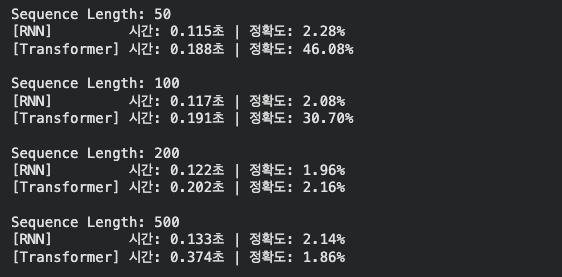
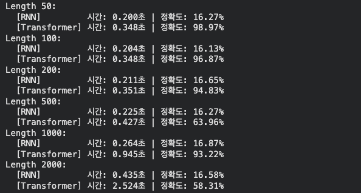

## 0. 논문 내용 실험(검증)

논문에서 제안하는 모델인 Transformer의 핵심 아이디어는 Self-Attention 메커니즘을 활용하여 시퀀스 데이터를 처리하는 것이다. 논문에서는 기존의 RNN과 CNN 기반 모델들이 시퀀스 데이터를 처리하는 데 있어서 발생하는 문제점들을 해결하기 위해 Transformer를 제안하였다.

그래서 다음 실험을 통해 논문에서 제안하는 모델의 성능을 검증해보았다. 

## 1. 실험1: RNN과 Transformer의 성능 비교

논문에서 주장한 트랜스포머의 두 가지 핵심 이점인 $$O(1)$$의 병렬 처리 속도와 $$O(1)$$의 장기 기억력을 검증하기 위해, RNN과 Transformer 모델을 동일한 데이터셋에서 학습시키고, 성능을 비교해보았다. 

- 가설1: 시퀀스 길이가 길어질수록 RNN은 순차 연산으로 인해 학습 속도가 느려지지만, Transformer는 병렬 처리를 통해 상대적으로 일정한 학습 속도를 유지할 것이다.
- 가설2: RNN은 시퀀스가 길어질수록 기울기 소실로 인해 앞부분의 정보를 망각하지만, Transformer는 Self-Attention 메커니즘을 통해 시퀀스의 모든 위치에서 정보를 참조할 수 있기 때문에 장기 기억력이 뛰어날 것이다.
  
> 실험 환경: 코랩 Pro, A100 GPU, 동일한 하이퍼파라미터 설정
> 실험 방법: 동일한 시퀀스 길이에서 RNN과 Transformer 모델을 학습시키고, 학습 속도와 성능을 비교

### 1.1 합성 데이터셋 생성

```python
class FirstTokenDataset(Dataset):
    def __init__(self, num_samples, seq_length, vocab_size = 50):
        self.num_samples = num_samples
        self.seq_length = seq_length
        self.vocab_size = vocab_size

        self.data = torch.randint(1,vocab_size, (num_samples, seq_length))

        self.target = self.data[:, 0].clone()

    def __len__(self):
        return self.num_samples

    def __getitem__(self, idx):
        return self.data[idx], self.target[idx]
```
- `nm_samples`: 생성할 전체 시퀀스의 수
- `seq_length`: 각 시퀀스의 길이


이렇게 아무런 의미가 없는 I.I.D(Independent and Identically Distributed) 데이터셋을 생성하였다. 각 시퀀스는 랜덤하게 생성된 토큰들로 이루어져 있으며, 모델이 시퀀스의 첫 번째 토큰을 예측하는 것이 목표이다. 
- 딥러닝 특성상 0은 주로 Padding이나 Unknown Token으로 사용되기 때문에, 토큰의 범위를 1부터 시작하도록 설정하였다.

### 1.2. 모델 정의

- RNN 모델 정의

```python
class ToyRNN(nn.Module):
    def __init__(self, vocab_size, embed_dim, hidden_dim):
        ....
        self.rnn = nn.RNN(embed_dim, hidden_dim, batch_first = True)
        ...

    def forward(self, x):
        ...
        last_output = out[:, -1 ,:]
        return self.fc(last_output)
```
- `self.rnn`: RNN 레이어를 정의한다. 입력 차원은 `embed_dim`, 출력 차원은 `hidden_dim`으로 설정하였다. `batch_first=True`로 설정하여 입력 텐서의 첫 번째 차원이 배치 크기가 되도록 하였다. 입력 데이터를 순서대로 읽으며 내부 상태를 업데이트한다.
- `last_output`: RNN의 출력에서 마지막 타임스텝의 출력을 추출한다. RNN은 시퀀스의 마지막 타임스텝에서 전체 시퀀스의 정보를 요약한 출력을 생성하므로, 이 출력을 사용하여 최종 예측을 수행한다.

- Transformer 모델 정의

```python
class ToyTransformer(nn.Module):
    def __init__(self, vocab_size, embed_dim, max_seq_length=2000):
        ...
        self.embedding = nn.Embedding(vocab_size, embed_dim)
        self.pos_embedding = nn.Embedding(max_seq_length, embed_dim)
        ...
        self.transformer = nn.TransformerEncoder(encoder_layer, num_layers = 1)
        self.fc = nn.Linear(embed_dim, vocab_size)

    def forward(self, x):
        ...
        last_output = out[:, -1, :]
        return self.fc(last_output)
```
- `self.pos_embedding`: 위치 임베딩 레이어를 정의한다. Transformer는 시퀀스의 순서를 인식하기 위해 위치 정보를 필요로 하므로, 각 위치에 대한 임베딩을 학습한다.
- `self.transformer`: 모든 토큰 사이의 관계를 한번에 계산한다.
- `out[:, -1, :]`: Transformer의 출력에서 마지막 타임스텝의 출력을 추출한다. Transformer는 시퀀스의 모든 위치에서 정보를 참조할 수 있기 때문에, 마지막 타임스텝의 출력은 전체 시퀀스의 정보를 요약한 벡터가 된다.

### 1.3. 테스트 함수

모델에게 데이터를 입력하여 예측을 수행하고, 예측 결과와 실제 타겟을 비교하여 정확도를 계산하는 테스트 함수를 정의하였다.

```python
def train_and_evaluate(model, dataloader, criterion, optimizer, device):
    model.train()
    correct = 0
    total = 0

    start_event = torch.cuda.Event(enable_timing = True)
    end_event = torch.cuda.Event(enable_timing = True)

    start_event.record()

    for inputs, targets in dataloader:
        inputs, targets = inputs.to(device), targets.to(device)
        optimizer.zero_grad()

        outputs = model(inputs)
        loss = criterion(outputs, targets)
        loss.backward()
        optimizer.step()

        _, predicted = outputs.max(1)
        total += targets.size(0)
        correct += predicted.eq(targets).sum().item()

    end_event.record()
    torch.cuda.synchronize()

    time_taken = start_event.elapsed_time(end_event) / 1000.0
    accuracy = 100. * correct / total

    return time_taken, accuracy
```
- `start_event`와 `end_event`: CUDA 이벤트를 사용하여 학습 시간을 측정한다. `enable_timing=True`로 설정하여 이벤트가 타이밍을 기록할 수 있도록 한다.
- `model.train()`: 모델을 학습 모드로 설정한다. 이는 드롭아웃과 배치 정규화와 같은 레이어가 학습 모드에서 동작하도록 한다.
- `optimizer.zero_grad()`: 모델의 매개변수에 대한 기울기를 초기화한다. 이는 이전 배치에서 계산된 기울기가 누적되는 것을 방지하기 위해 필요하다.
- `loss.backward()`: 손실 함수에 대한 기울기를 계산한다. 이는 모델의 매개변수에 대한 기울기를 자동으로 계산하여 역전파를 수행한다.
- `optimizer.step()`: 모델의 매개변수를 업데이트한다. 이는 계산된 기울기를 사용하여 모델의 매개변수를 조정하여 손실을 최소화한다.
- `predicted.eq(targets).sum().item()`: 모델의 예측과 실제 타겟을 비교하여 정확한 예측의 수를 계산한다. `predicted.eq(targets)`는 예측과 타겟이 일치하는 위치에 `True` 값을 가지는 텐서를 반환하며, `sum()`을 사용하여 일치하는 예측의 총 수를 계산한다.

### 1.4. 실험 결과 (메인 실행부분)

우선 하이퍼파라미터를 다음과 같이 설정하였다. 시퀀스 길이는 2000으로 설정하여 RNN이 긴 시퀀스에서 성능이 저하되는 현상을 관찰할 수 있도록 하였다.

```python
sequence_lengths = [50, 100, 200, 500] # 입력 데이터의 길이
vocab_size = 50 # 숫자의 종류 (1~49까지 사용 -> 이 값이 작을수록 모델이 찍어서 맞출 확률이 증가)
embed_dim = 64 # 단어의 차원
hidden_dim = 64 # 모델의 신경망 크기
num_samples = 5000 # 데이터셋 크기
batch_size = 128 # 한 번에 학습할 양
```

```python
for seq_len in sequence_lengths:
    dataset = FirstTokenDataset(num_samples, seq_len, vocab_size)
    dataloader = DataLoader(dataset, batch_size = batch_size, shuffle = True)

    rnn_model = ToyRNN(vocab_size, embed_dim, hidden_dim).to(device)
    tf_model = ToyTransformer(vocab_size, embed_dim).to(device)

    criterion = nn.CrossEntropyLoss()
    rnn_optim = optim.Adam(rnn_model.parameters(), lr = 0.005)
    tf_optim = optim.Adam(tf_model.parameters(), lr = 0.005)

    rnn_time, rnn_acc = train_and_evaluate(rnn_model, dataloader, criterion, rnn_optim, device)
    rnn_times.append(rnn_time)
    rnn_accs.append(rnn_acc)
    
    tf_time, tf_acc = train_and_evaluate(tf_model, dataloader, criterion, tf_optim, device)
    tf_times.append(tf_time)
    tf_accs.append(tf_acc)
```
우선 다음과같이 시퀀스 길이에 따른 RNN과 Transformer의 학습 시간과 정확도를 기록하였다.



몇 번의 실험을 반복하여 평균을  구한 결과, 다음과 같은 결과가 나왔다.

- RNN
  - RNN은 50, 100, 200, 500 할 거 없이 전부 2% 내외의 확률을 보였다. 
  - 이는 모델이 시퀀스의 첫 번째 토큰을 예측하는 것이 거의 불가능하다는 것을 의미한다. RNN은 시퀀스의 마지막 타임스텝에서 전체 시퀀스의 정보를 요약한 출력을 생성하지만, 긴 시퀀스에서는 기울기 소실로 인해 앞부분의 정보를 망각하기 때문에 정확도가 매우 낮게 나타났다.

- Transformer
    - 길이가 50, 100일 때는 준수한 정확도를 보였지만, 길이가 200, 500일 때는 2% 내외의 확률을 보였다.
    - 이는 Transformer가 시퀀스의 모든 위치에서 정보를 참조할 수 있기 때문에, 시퀀스가 짧을 때는 첫 번째 토큰을 예측하는 데 성공하지만, 시퀀스가 길어질수록 모델이 시퀀스의 모든 위치에서 정보를 참조하는 과정에서 노이즈가 증가하여 정확도가 낮아지는 현상이 발생할 수 있음을 시사한다.
  
현재 epoch 수가 1로 설정되어 있기 때문에, 모델이 충분히 학습되지 않았을 가능성이 있다. 따라서 epoch 수를 늘려서 모델이 충분히 학습된 후의 성능을 다시 평가해보는 것이 필요하다. 또한, 시퀀스 길이가 길어질수록 모델이 시퀀스의 모든 위치에서 정보를 참조하는 과정에서 노이즈가 증가하여 정확도가 낮아지는 현상이 발생할 수 있으므로, 시퀀스 길이에 따른 모델의 성능 변화를 더 자세히 분석해보는 것도 필요하다.

### 2. epoch 수 증가에 따른 성능 변화

하이퍼 파라미터에서 epoch 수를 10으로 늘려서 모델이 충분히 학습된 후의 성능을 다시 평가해보았다.
```python
sequence_lengths = [50, 100, 200, 500, 1000, 2000]
num_trials = 3 
num_epochs = 10
vocab_size = 50
embed_dim = 64
hidden_dim = 64
num_samples = 5000
batch_size = 64
```
과부하를 줄이기 위해 `batch_size`를 128에서 64로 줄였다. 또한 시퀀스 길이를 1000과 2000까지 늘려서 모델의 성능 변화를 더 자세히 분석해보았다. 또한, 10에폭의 평균을 구하기 위해 3번의 실험을 반복하였다.



#### 실험 결과

1. 정확도(Accurancy)
- RNN
  - RNN은 시퀀스 길이에 상관없이 16% 내외의 정확도를 보였다.
  - 이는 마찬가지로 전형적인 기울기 소실 현상이다. 10에폭을 학습했음에도 RNN의 구조적 특성상 시퀀스 앞부분의 정보가 뒷부분까지 전달되지 못한다.
  
- Transformer
    - Transformer는 시퀀스 길이가 1000일 때도 93.22%의 정확도를 보였다. 
    - 이는 $$O(1)$$의 장기 기억력을 가진 Self-Attention 메커니즘 덕분에 시퀀스의 모든 위치에서 정보를 참조할 수 있기 때문에, 시퀀스가 길어질수록 모델이 시퀀스의 모든 위치에서 정보를 참조하는 과정에서 노이즈가 증가하여 정확도가 낮아지는 현상이 발생하지 않음을 시사한다.

2. 시간(Time)
- RNN
  - RNN은 길이가 40배(50 -> 2000) 늘어나는 동안 시간은 약 2.1배(0.2초 -> 0.435초)만 증가하였다.
  - 성능은 좋지 않지만, 연산 효율만큼은 시퀀스 길이에 선형적으로 비례하는 RNN의 특성이 잘 나타났다.

- Transformer
  - 길이가 2배(1000 -> 2000) 늘어났을 때, 시간은 약 2.6배(0.945초 -> 2.524초)로 증가하였다.
  - 이는 Transformer의 $$O(n^2)$$인 연산 복잡도 때문이다. 시퀀스가 길어질수록 어텐션 맵의 크기가 제곱으로 커지기 때문에, 일정 구간을 넘어서면 연산 시간이 기하급수적으로 늘어나는 현상이 발생한다.
  
3. 이상현상

데이터에서 500과 2000에서 정확도가 떨어지는 지점이 있다.
1. 시퀀스가 길어질수록 모델이 시퀀스의 모든 위치에서 정보를 참조하는 과정에서 노이즈가 증가하여 정확도가 낮아지는 현상이 발생할 수 있다. 
2. 1000에서는 93%인데 500에서 63%인 것은, 3번의 실험 중 한 번이 초기 가중치 운이 나빠서 실패했을 가능성이 있다. 


나는 Transformer가 병렬처리이기에 시퀀스 길이에 상관없이 일정한 학습 속도를 유지할 것이라고 예상했지만, 실제로는 시퀀스 길이가 늘어날수록 학습 시간이 증가하는 것을 확인했다. 
- 이는 병렬 처리가 연산량 자체를 줄여주지는 않는다는 것이다.
- Transformer는 모든 토큰이 서로를 쳐다봐야 하므로 총 연산 횟수가 시퀀스 길이에 따라 제곱으로 증가한다. 병렬 처리를 통해 대기 시간은 줄였지만, GPU가 처리해야 할 총 업무량 자체가 늘어나기 때문에 학습 시간이 증가하는 것이다.

