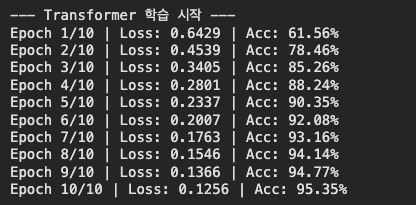
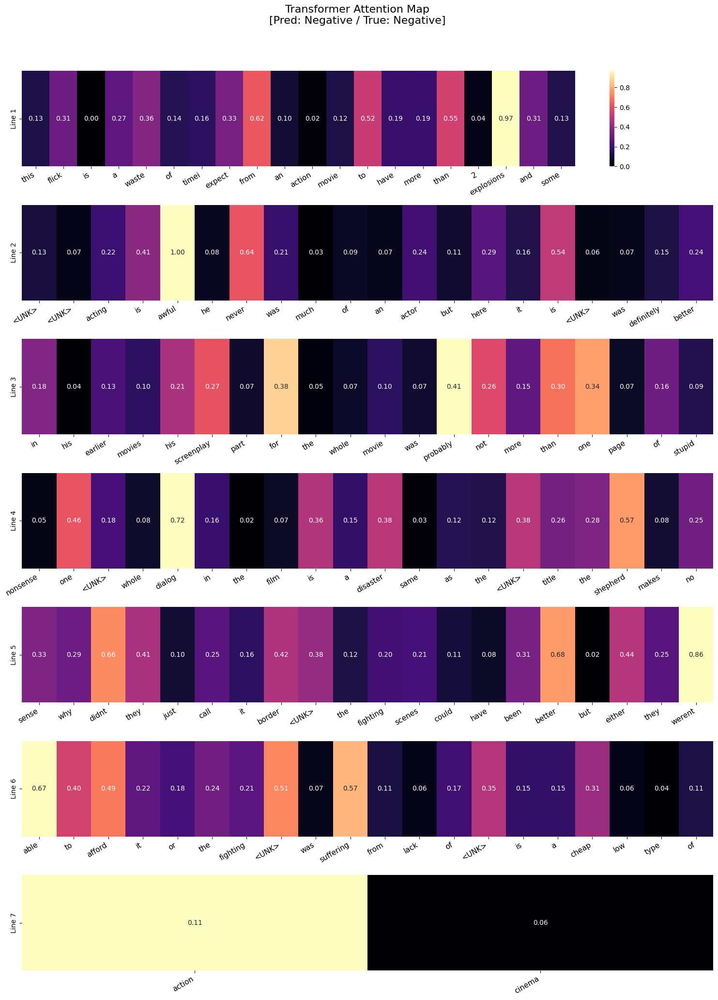

## 0. 논문 내용 실험(검증)

논문에서 제안하는 모델인 Transformer의 핵심 아이디어는 Self-Attention 메커니즘을 활용하여 시퀀스 데이터를 처리하는 것이다. 논문에서는 기존의 RNN과 CNN 기반 모델들이 시퀀스 데이터를 처리하는 데 있어서 발생하는 문제점들을 해결하기 위해 Transformer를 제안하였다.

그래서 다음 실험을 통해 논문에서 제안하는 모델의 성능을 검증해보았다. 

## 1. 실험1: RNN과 Transformer의 성능 비교

논문에서 주장한 트랜스포머의 두 가지 핵심 이점인 $$O(1)$$의 병렬 처리 속도와 $$O(1)$$의 장기 기억력을 검증하기 위해, RNN과 Transformer 모델을 동일한 데이터셋에서 학습시키고, 성능을 비교해보았다. 

- 가설1: 시퀀스 길이가 길어질수록 RNN은 순차 연산으로 인해 학습 속도가 느려지지만, Transformer는 병렬 처리를 통해 상대적으로 일정한 학습 속도를 유지할 것이다.
- 가설2: RNN은 시퀀스가 길어질수록 기울기 소실로 인해 앞부분의 정보를 망각하지만, Transformer는 Self-Attention 메커니즘을 통해 시퀀스의 모든 위치에서 정보를 참조할 수 있기 때문에 장기 기억력이 뛰어날 것이다.
  
> 실험 환경: 코랩 Pro, A100 GPU, 동일한 하이퍼파라미터 설정
> 실험 방법: 동일한 시퀀스 길이에서 RNN과 Transformer 모델을 학습시키고, 학습 속도와 성능을 비교

### 1.1 합성 데이터셋 생성

```python
class FirstTokenDataset(Dataset):
    def __init__(self, num_samples, seq_length, vocab_size = 50):
        self.num_samples = num_samples
        self.seq_length = seq_length
        self.vocab_size = vocab_size

        self.data = torch.randint(1,vocab_size, (num_samples, seq_length))

        self.target = self.data[:, 0].clone()

    def __len__(self):
        return self.num_samples

    def __getitem__(self, idx):
        return self.data[idx], self.target[idx]
```
- `nm_samples`: 생성할 전체 시퀀스의 수
- `seq_length`: 각 시퀀스의 길이


이렇게 아무런 의미가 없는 I.I.D(Independent and Identically Distributed) 데이터셋을 생성하였다. 각 시퀀스는 랜덤하게 생성된 토큰들로 이루어져 있으며, 모델이 시퀀스의 첫 번째 토큰을 예측하는 것이 목표이다. 
- 딥러닝 특성상 0은 주로 Padding이나 Unknown Token으로 사용되기 때문에, 토큰의 범위를 1부터 시작하도록 설정하였다.

### 1.2. 모델 정의

- RNN 모델 정의

```python
class ToyRNN(nn.Module):
    def __init__(self, vocab_size, embed_dim, hidden_dim):
        ....
        self.rnn = nn.RNN(embed_dim, hidden_dim, batch_first = True)
        ...

    def forward(self, x):
        ...
        last_output = out[:, -1 ,:]
        return self.fc(last_output)
```
- `self.rnn`: RNN 레이어를 정의한다. 입력 차원은 `embed_dim`, 출력 차원은 `hidden_dim`으로 설정하였다. `batch_first=True`로 설정하여 입력 텐서의 첫 번째 차원이 배치 크기가 되도록 하였다. 입력 데이터를 순서대로 읽으며 내부 상태를 업데이트한다.
- `last_output`: RNN의 출력에서 마지막 타임스텝의 출력을 추출한다. RNN은 시퀀스의 마지막 타임스텝에서 전체 시퀀스의 정보를 요약한 출력을 생성하므로, 이 출력을 사용하여 최종 예측을 수행한다.

- Transformer 모델 정의

```python
class ToyTransformer(nn.Module):
    def __init__(self, vocab_size, embed_dim, max_seq_length=2000):
        ...
        self.embedding = nn.Embedding(vocab_size, embed_dim)
        self.pos_embedding = nn.Embedding(max_seq_length, embed_dim)
        ...
        self.transformer = nn.TransformerEncoder(encoder_layer, num_layers = 1)
        self.fc = nn.Linear(embed_dim, vocab_size)

    def forward(self, x):
        ...
        last_output = out[:, -1, :]
        return self.fc(last_output)
```
- `self.pos_embedding`: 위치 임베딩 레이어를 정의한다. Transformer는 시퀀스의 순서를 인식하기 위해 위치 정보를 필요로 하므로, 각 위치에 대한 임베딩을 학습한다.
- `self.transformer`: 모든 토큰 사이의 관계를 한번에 계산한다.
- `out[:, -1, :]`: Transformer의 출력에서 마지막 타임스텝의 출력을 추출한다. Transformer는 시퀀스의 모든 위치에서 정보를 참조할 수 있기 때문에, 마지막 타임스텝의 출력은 전체 시퀀스의 정보를 요약한 벡터가 된다.

### 1.3. 테스트 함수

모델에게 데이터를 입력하여 예측을 수행하고, 예측 결과와 실제 타겟을 비교하여 정확도를 계산하는 테스트 함수를 정의하였다.

```python
def train_and_evaluate(model, dataloader, criterion, optimizer, device):
    model.train()
    correct = 0
    total = 0

    start_event = torch.cuda.Event(enable_timing = True)
    end_event = torch.cuda.Event(enable_timing = True)

    start_event.record()

    for inputs, targets in dataloader:
        inputs, targets = inputs.to(device), targets.to(device)
        optimizer.zero_grad()

        outputs = model(inputs)
        loss = criterion(outputs, targets)
        loss.backward()
        optimizer.step()

        _, predicted = outputs.max(1)
        total += targets.size(0)
        correct += predicted.eq(targets).sum().item()

    end_event.record()
    torch.cuda.synchronize()

    time_taken = start_event.elapsed_time(end_event) / 1000.0
    accuracy = 100. * correct / total

    return time_taken, accuracy
```
- `start_event`와 `end_event`: CUDA 이벤트를 사용하여 학습 시간을 측정한다. `enable_timing=True`로 설정하여 이벤트가 타이밍을 기록할 수 있도록 한다.
- `model.train()`: 모델을 학습 모드로 설정한다. 이는 드롭아웃과 배치 정규화와 같은 레이어가 학습 모드에서 동작하도록 한다.
- `optimizer.zero_grad()`: 모델의 매개변수에 대한 기울기를 초기화한다. 이는 이전 배치에서 계산된 기울기가 누적되는 것을 방지하기 위해 필요하다.
- `loss.backward()`: 손실 함수에 대한 기울기를 계산한다. 이는 모델의 매개변수에 대한 기울기를 자동으로 계산하여 역전파를 수행한다.
- `optimizer.step()`: 모델의 매개변수를 업데이트한다. 이는 계산된 기울기를 사용하여 모델의 매개변수를 조정하여 손실을 최소화한다.
- `predicted.eq(targets).sum().item()`: 모델의 예측과 실제 타겟을 비교하여 정확한 예측의 수를 계산한다. `predicted.eq(targets)`는 예측과 타겟이 일치하는 위치에 `True` 값을 가지는 텐서를 반환하며, `sum()`을 사용하여 일치하는 예측의 총 수를 계산한다.

### 1.4. 실험 결과 (메인 실행부분)

우선 하이퍼파라미터를 다음과 같이 설정하였다. 시퀀스 길이는 2000으로 설정하여 RNN이 긴 시퀀스에서 성능이 저하되는 현상을 관찰할 수 있도록 하였다.

```python
sequence_lengths = [50, 100, 200, 500] # 입력 데이터의 길이
vocab_size = 50 # 숫자의 종류 (1~49까지 사용 -> 이 값이 작을수록 모델이 찍어서 맞출 확률이 증가)
embed_dim = 64 # 단어의 차원
hidden_dim = 64 # 모델의 신경망 크기
num_samples = 5000 # 데이터셋 크기
batch_size = 128 # 한 번에 학습할 양
```

```python
for seq_len in sequence_lengths:
    dataset = FirstTokenDataset(num_samples, seq_len, vocab_size)
    dataloader = DataLoader(dataset, batch_size = batch_size, shuffle = True)

    rnn_model = ToyRNN(vocab_size, embed_dim, hidden_dim).to(device)
    tf_model = ToyTransformer(vocab_size, embed_dim).to(device)

    criterion = nn.CrossEntropyLoss()
    rnn_optim = optim.Adam(rnn_model.parameters(), lr = 0.005)
    tf_optim = optim.Adam(tf_model.parameters(), lr = 0.005)

    rnn_time, rnn_acc = train_and_evaluate(rnn_model, dataloader, criterion, rnn_optim, device)
    rnn_times.append(rnn_time)
    rnn_accs.append(rnn_acc)
    
    tf_time, tf_acc = train_and_evaluate(tf_model, dataloader, criterion, tf_optim, device)
    tf_times.append(tf_time)
    tf_accs.append(tf_acc)
```
우선 다음과같이 시퀀스 길이에 따른 RNN과 Transformer의 학습 시간과 정확도를 기록하였다.


몇 번의 실험을 반복하여 평균을  구한 결과, 다음과 같은 결과가 나왔다.

- RNN
  - RNN은 50, 100, 200, 500 할 거 없이 전부 2% 내외의 확률을 보였다. 
  - 이는 모델이 시퀀스의 첫 번째 토큰을 예측하는 것이 거의 불가능하다는 것을 의미한다. RNN은 시퀀스의 마지막 타임스텝에서 전체 시퀀스의 정보를 요약한 출력을 생성하지만, 긴 시퀀스에서는 기울기 소실로 인해 앞부분의 정보를 망각하기 때문에 정확도가 매우 낮게 나타났다.

- Transformer
    - 길이가 50, 100일 때는 준수한 정확도를 보였지만, 길이가 200, 500일 때는 2% 내외의 확률을 보였다.
    - 이는 Transformer가 시퀀스의 모든 위치에서 정보를 참조할 수 있기 때문에, 시퀀스가 짧을 때는 첫 번째 토큰을 예측하는 데 성공하지만, 시퀀스가 길어질수록 모델이 시퀀스의 모든 위치에서 정보를 참조하는 과정에서 노이즈가 증가하여 정확도가 낮아지는 현상이 발생할 수 있음을 시사한다.
  
현재 epoch 수가 1로 설정되어 있기 때문에, 모델이 충분히 학습되지 않았을 가능성이 있다. 따라서 epoch 수를 늘려서 모델이 충분히 학습된 후의 성능을 다시 평가해보는 것이 필요하다. 또한, 시퀀스 길이가 길어질수록 모델이 시퀀스의 모든 위치에서 정보를 참조하는 과정에서 노이즈가 증가하여 정확도가 낮아지는 현상이 발생할 수 있으므로, 시퀀스 길이에 따른 모델의 성능 변화를 더 자세히 분석해보는 것도 필요하다.

### 2. epoch 수 증가에 따른 성능 변화

하이퍼 파라미터에서 epoch 수를 10으로 늘려서 모델이 충분히 학습된 후의 성능을 다시 평가해보았다.
```python
sequence_lengths = [50, 100, 200, 500, 1000, 2000]
num_trials = 3 
num_epochs = 10
vocab_size = 50
embed_dim = 64
hidden_dim = 64
num_samples = 5000
batch_size = 64
```
과부하를 줄이기 위해 `batch_size`를 128에서 64로 줄였다. 또한 시퀀스 길이를 1000과 2000까지 늘려서 모델의 성능 변화를 더 자세히 분석해보았다. 또한, 10에폭의 평균을 구하기 위해 3번의 실험을 반복하였다.


#### 실험 결과

1. 정확도(Accurancy)
- RNN
  - RNN은 시퀀스 길이에 상관없이 16% 내외의 정확도를 보였다.
  - 이는 마찬가지로 전형적인 기울기 소실 현상이다. 10에폭을 학습했음에도 RNN의 구조적 특성상 시퀀스 앞부분의 정보가 뒷부분까지 전달되지 못한다.
  
- Transformer
    - Transformer는 시퀀스 길이가 1000일 때도 93.22%의 정확도를 보였다. 
    - 이는 $$O(1)$$의 장기 기억력을 가진 Self-Attention 메커니즘 덕분에 시퀀스의 모든 위치에서 정보를 참조할 수 있기 때문에, 시퀀스가 길어질수록 모델이 시퀀스의 모든 위치에서 정보를 참조하는 과정에서 노이즈가 증가하여 정확도가 낮아지는 현상이 발생하지 않음을 시사한다.

2. 시간(Time)
- RNN
  - RNN은 길이가 40배(50 -> 2000) 늘어나는 동안 시간은 약 2.1배(0.2초 -> 0.435초)만 증가하였다.
  - 성능은 좋지 않지만, 연산 효율만큼은 시퀀스 길이에 선형적으로 비례하는 RNN의 특성이 잘 나타났다.

- Transformer
  - 길이가 2배(1000 -> 2000) 늘어났을 때, 시간은 약 2.6배(0.945초 -> 2.524초)로 증가하였다.
  - 이는 Transformer의 $$O(n^2)$$인 연산 복잡도 때문이다. 시퀀스가 길어질수록 어텐션 맵의 크기가 제곱으로 커지기 때문에, 일정 구간을 넘어서면 연산 시간이 기하급수적으로 늘어나는 현상이 발생한다.
  
3. 이상현상

데이터에서 500과 2000에서 정확도가 떨어지는 지점이 있다.
1. 시퀀스가 길어질수록 모델이 시퀀스의 모든 위치에서 정보를 참조하는 과정에서 노이즈가 증가하여 정확도가 낮아지는 현상이 발생할 수 있다. 
2. 1000에서는 93%인데 500에서 63%인 것은, 3번의 실험 중 한 번이 초기 가중치 운이 나빠서 실패했을 가능성이 있다. 


나는 Transformer가 병렬처리이기에 시퀀스 길이에 상관없이 일정한 학습 속도를 유지할 것이라고 예상했지만, 실제로는 시퀀스 길이가 늘어날수록 학습 시간이 증가하는 것을 확인했다. 
- 이는 병렬 처리가 연산량 자체를 줄여주지는 않는다는 것이다.
- Transformer는 모든 토큰이 서로를 쳐다봐야 하므로 총 연산 횟수가 시퀀스 길이에 따라 제곱으로 증가한다. 병렬 처리를 통해 대기 시간은 줄였지만, GPU가 처리해야 할 총 업무량 자체가 늘어나기 때문에 학습 시간이 증가하는 것이다.


## 2. 실험2: IMDB 데이터셋으로 보는 Attention 시각화

실험 1에서 진행한 첫 번째 토큰 찾기는 모델의 아키텍처 특성을 파악하기엔 좋았으나, 실제 언어가 가진 문맥을 담지는 못했다. 따라서 실험 2에서는 IMDB 데이터셋을 활용하여 아래와같은 가설을 검증해보았다.
- 성능: 긍정/부정 분류라는 실제 언어의 문맥을 담은 태스크에서, RNN은 문장이 길어질수록 초반의 표현을 잊고 후반부 단어에 치우칠 가능성이 있지만, Transformer는 전체 문맥을 골고루 참조하여 더 높은 정확도를 보일 것이다.
- 시각화: Transformer의 Self-Attention 메커니즘을 시각화하면, 감정을 결정짓는 핵심 형용사에 강한 가중치가 부여되는 것을 확인할 수 있을 것이다.

감정 문류는 문장을 읽고 작성자의 감정이 긍정(1)인지 부정(0)인지 이진 분류(Binary Classification)하는 태스크이다. 
- 데이터셋: IMDB 영화 리뷰 데이터셋 (25,000개의 훈련 샘플과 25,000개의 테스트 샘플로 구성)
- 전처리 과정: HTML 태그 및 특수문자 제거, 토큰화, 패딩 및 트렁케이팅
- 모델 구조: 실험 1에서 사용한 RNN과 Transformer 모델을 감정 분류 태스크에 맞게 수정하여 사용


### 1.1 IMDB 전처리

```python
def tokenizer(text):
    text = text.lower()  # 소문자 변환
    text = re.sub(r"<[^>]+>", "", text)  # HTML 태그 제거
    text = re.sub(r"[^a-z0-9\s]", "", text)  # 특수문자 제거
    return text.split()  # 공백 기준 토큰화

dataset = load_dataset("imdb")
counter = Counter()
for eg in dataset["train"]:
    # 각 리뷰를 토큰화하여 단어 등장 횟수를 카운트함
    counter.update(tokenizer(eg["text"]))
```
- `tokenizer` 함수는 텍스트를 소문자로 변환하고, HTML 태그와 특수문자를 제거한 후, 공백을 기준으로 토큰화하는 역할을 한다. 이렇게 전처리된 텍스트는 모델이 학습하기에 더 적합한 형태로 변환된다.
- `Counter` 객체를 사용하여 훈련 데이터셋의 모든 리뷰에서 단어 등장 횟수를 카운트한다. 이를 통해 단어 빈도에 기반한 어휘 사전을 구축할 수 있다.

```python
vocab_size = 10000 # 사전에 포함할 최대 단어 수
vocab = {"<PAD>": 0, "<UNK>": 1} # 특수 토큰 정의

# 가장 빈번하게 등장한 단어 순으로 고유 번호 부여
for word, _ in counter.most_common(vocab_size - 2):
    vocab[word] = len(vocab)
```
- `vocab_size`는 모델이 학습할 때 사용할 최대 단어 수를 정의한다. 여기서는 10,000으로 설정하였다.
- `vocab` 딕셔너리는 특수 토큰 `<PAD>`와 `<UNK>`를 포함하여 단어와 고유 번호를 매핑하는 역할을 한다. `<PAD>`는 패딩 토큰으로 사용되고, `<UNK>`는 어휘 사전에 없는 단어를 나타내는 토큰이다.
- `counter.most_common(vocab_size - 2)`를 사용하여 가장 빈번하게 등장한 단어를 순서대로 가져와서 `vocab` 딕셔너리에 고유 번호를 부여한다. 이렇게 하면 모델이 학습할 때 자주 등장하는 단어에 대한 임베딩을 학습할 수 있다.
    - 2를 뺴는 이유는 `<PAD>`와 `<UNK>` 토큰이 이미 2개의 고유 번호를 차지하기 때문이다.
    - `<PAD`:0, 문장의 길이를 맞추기 위해 채워넣는 빈 공간
    - `<UNK>`:1, 어휘 사전에 없는 단어를 나타내는 토큰


### 1.2 데이터 변환

원문 데이터를 파이토치 모델에 바로 넣을 수 있는 형태로 가공해야 한다.

```python
class IMDBDataset(torch.utils.data.Dataset):
    def __init__(self, hf_dataset, vocab, max_length = 256):
        self.data = list()
        self.labels = list()
        for eg in hf_dataset:
            tokens = tokenizer(eg["text"])
            encoded = [vocab.get(word, vocab["<UNK>"]) for word in tokens]
            if len(encoded) < max_length:
                encoded += [vocab["<PAD>"]] * (max_length - len(encoded))
            else:
                encoded = encoded[:max_length]
            self.data.append(encoded)
            self.labels.append(eg["label"])

    def __len__(self):
        return len(self.data)

    def __getitem__(self, idx):
        return torch.tensor(self.data[idx]), torch.tensor(self.labels[idx], dtype = torch.float32)
```
위와 같이 `IMDBDataset` 클래스를 정의하여, Hugging Face 데이터셋에서 텍스트 데이터를 토큰화하고, 어휘 사전을 사용하여 인덱스로 변환한 후, 패딩 또는 트렁케이팅을 수행하여 고정된 길이의 시퀀스로 변환한다. 이렇게 변환된 데이터는 모델에 입력으로 사용할 수 있는 형태가 된다. 또한, 각 샘플의 레이블도 함께 저장하여 모델이 학습할 때 사용할 수 있도록 한다.
- `IMDBDataset` 클래스는 PyTorch의 `Dataset` 클래스를 상속하여 구현된 커스텀 데이터셋 클래스이다. 이 클래스는 Hugging Face 데이터셋에서 텍스트 데이터를 처리하여 모델에 입력으로 사용할 수 있는 형태로 변환하는 역할을 한다.
- `__init__` 메서드는 데이터셋을 초기화하는 역할을 한다
- `__getitem__` 메서드는 데이터셋에서 특정 인덱스에 해당하는 샘플을 반환하는 역할을 한다. 이 메서드는 모델이 학습할 때 배치 단위로 데이터를 가져올 때 사용된다. 반환되는 데이터는 텐서 형태로 변환되어 모델에 입력으로 사용할 수 있다.
- vocab.get(word, vocab["<UNK>"])는 어휘 사전에 없는 단어에 대해 `<UNK>` 토큰의 인덱스를 반환하도록 한다. 이렇게 하면 모델이 학습할 때 어휘 사전에 없는 단어를 처리할 수 있다.


### 1.3 모델 정의

```python
class VisualizableTransformer(nn.Module):
    def __init__(self, vocab_size, embed_dim, max_seq_length=256):
        super().__init__()
        self.embedding = nn.Embedding(vocab_size, embed_dim)
        self.pos_embedding = nn.Embedding(max_seq_length, embed_dim)

        self.encoder_layer = nn.TransformerEncoderLayer(
            d_model=embed_dim, nhead=2, dim_feedforward=embed_dim*2, batch_first=True
        )
        self.fc = nn.Linear(embed_dim, 2)

    def forward(self, x, return_attn=False):
        seq_len = x.size(1)
        positions = torch.arange(0, seq_len, device=x.device).unsqueeze(0).expand(x.size(0), -1)
        embedded = self.embedding(x) + self.pos_embedding(positions)

        if return_attn:
            attn_output, attn_weights = self.encoder_layer.self_attn(embedded, embedded, embedded, need_weights=True)
            out = self.fc(attn_output[:, -1, :])
            return out, attn_weights
        else:
            out = self.encoder_layer(embedded)
            last_output = out[:, -1, :]
            return self.fc(last_output)
```
- `VisualizableTransformer` 클래스는 Transformer 모델을 정의하는 PyTorch 모듈이다. 이 모델은 입력 시퀀스를 임베딩하고, 위치 임베딩을 추가한 후, Transformer 인코더 레이어를 통과시켜 최종적으로 감정 분류를 수행하는 구조로 되어 있다.
- `forward` 메서드는 모델의 순전파 과정을 정의한다. 입력 시퀀스 `x`를 임베딩하고, 위치 임베딩을 추가한 후, Transformer 인코더 레이어를 통과시킨다. `return_attn` 인자를 통해 어텐션 가중치를 반환할지 여부를 결정할 수 있다. 어텐션 가중치를 반환하는 경우, `self_attn` 메서드에서 `need_weights=True`로 설정하여 어텐션 가중치를 계산하도록 한다. 최종 출력은 시퀀스의 마지막 타임스텝의 출력을 사용하여 감정 분류를 수행한다.
- `nn.TransformerEncoderLayer`는 PyTorch에서 제공하는 Transformer 인코더 레이어를 정의하는 클래스이다. `d_model`은 임베딩 차원, `nhead`는 어텐션 헤드의 수, `dim_feedforward`는 피드포워드 네트워크의 차원을 설정하는 하이퍼파라미터이다. `batch_first=True`로 설정하여 입력 텐서의 첫 번째 차원이 배치 크기가 되도록 한다.
- `self.pos_embedding`은 위치 임베딩 레이어를 정의한다. Transformer는 시퀀스의 순서를 인식하기 위해 위치 정보를 필요로 하므로, 각 위치에 대한 임베딩을 학습한다. `max_seq_length`는 모델이 처리할 수 있는 최대 시퀀스 길이를 설정하는 하이퍼파라미터이다.
- `return_attn` 인자를 통해 어텐션 가중치를 반환할지 여부를 결정할 수 있다. 일반적인 PyTorch의 `TransformerEncoder`를 그냥 통과시키면 최종 결과물만 나오고 내부의 Attention 점수는 나오지 않지만, `self_attn` 메서드를 직접 호출하여 `need_weights=True`로 설정하면 어텐션 가중치를 계산하여 반환할 수 있다. 이렇게 하면 모델이 입력 시퀀스의 어떤 부분에 주목하는지를 시각화할 수 있다.

### 1.4 모델 학습 함수

```python
def train_model(model, dataloader, criterion, optimizer, num_epochs=3):
    model.train()
    for epoch in range(num_epochs):
        total_loss = 0
        correct = 0
        total = 0
        for inputs, targets in dataloader:
            inputs, targets = inputs.to(device), targets.to(device).long()

            optimizer.zero_grad()
            outputs = model(inputs) 

            loss = criterion(outputs, targets)
            loss.backward()
            optimizer.step()

            total_loss += loss.item()
            _, predicted = outputs.max(1)
            total += targets.size(0)
            correct += predicted.eq(targets).sum().item()

        acc = 100. * correct / total
        print(f"Epoch {epoch+1}/{num_epochs} | Loss: {total_loss/len(dataloader):.4f} | Acc: {acc:.2f}%")
```
- `train_model` 함수는 모델을 학습하는 역할을 한다. 주어진 데이터로더를 사용하여 모델을 학습시키고, 각 에폭마다 손실과 정확도를 출력한다. 이 함수는 모델이 충분히 학습될 때까지 반복적으로 데이터를 입력하여 모델의 매개변수를 업데이트한다.
- `model.train()`은 모델을 학습 모드로 설정한다. 이는 드롭아웃과 배치 정규화와 같은 레이어가 학습 모드에서 동작하도록 한다.
- `optimizer.zero_grad()`는 모델의 매개변수에 대한 기울기를 초기화한다. 이는 이전 배치에서 계산된 기울기가 누적되는 것을 방지하기 위해 필요하다.
- `loss.backward()`는 손실 함수에 대한 기울기를 계산한다. 이는 모델의 매개변수에 대한 기울기를 자동으로 계산하여 역전파를 수행한다.
- `optimizer.step()`는 모델의 매개변수를 업데이트한다.


### 1.5 모델 평가 및 어텐션 시각화

```python
vocab_size = len(vocab)
embed_dim = 64
hidden_dim = 64

print("\n--- Transformer 학습 시작 ---")
tf_model = VisualizableTransformer(vocab_size, embed_dim).to(device)
criterion = nn.CrossEntropyLoss()
tf_optim = optim.Adam(tf_model.parameters(), lr=0.001)

train_model(tf_model, train_loader, criterion, tf_optim, num_epochs=10)

print("\n--- 어텐션 맵 시각화 ---")
visualize_attention_wrapped(tf_model, test_dataset, idx_to_word, sample_idx=10, tokens_per_row=20)
```
- `train_model` 함수를 호출하여 Transformer 모델을 학습시킨다. 학습이 완료된 후, `visualize_attention_wrapped` 함수를 호출하여 테스트 데이터셋에서 특정 샘플에 대한 어텐션 맵을 시각화한다.
- `visualize_attention_wrapped` 함수는 모델과 데이터셋, 인덱스-단어 매핑을 입력으로 받아, 특정 샘플에 대한 어텐션 맵을 시각화하는 래퍼 함수이다. `sample_idx`는 시각화할 샘플의 인덱스를 지정하고, `tokens_per_row`는 시각 행에 표시할 토큰의 수를 설정한다. 이 함수를 통해 모델이 입력 시퀀스의 어떤 부분에 주목하는지를 시각적으로 확인할 수 있다.

10에폭 정도 학습을 시킨 후, 테스트 데이터셋에서 특정 샘플에 대한 어텐션 맵을 시각화 해보았다. 




1. 학습 지표 분석
- 정확도: 61% -> 95%. 첫 에폭에서는 아쉬운 정확도를 보였지만 10에폭만에 95%의 정확도를 달성하였다. 
- 손실: 0.64 -> 0.12. 손실 값이 꾸준히 우하향하며 안정적으로 학습이 진행되고 있음을 보여준다.

2. 어텐션 맵 해석
- 최고점 1.00: `awful` 단어에 가장 높은 어텐션 가중치가 부여되었다. 이는 모델이 이 단어를 감정 분류에 있어서 가장 중요한 단어로 인식하고 있음을 시사한다. 
- 핵심 키워드: `waste`, `nonsense`, `disaster`같은 영화 비평에 자주 쓰이는 부정적 어휘들을 짚어내고 있다.


시각화 결과, Transformer는 사람이 글을 읽을 때와 유사한 방식으로 문장을 처리하고 있는 것을 알 수 있었다. `awful(1.00)`이나 `disaster(0.38)` 같은 감성 키워드뿐만 아니라, 의미를 반전시키는 `never`, `werent` 같은 부정어까지 정확히 포착해냈다.

특히 Min-Max 정규화를 통해 어텐션 가중치가 0에서 1 사이로 스케일링되어, 모델이 어떤 단어에 가장 집중하고 있는지를 명확하게 시각화할 수 있었다. 이는 Transformer의 Self-Attention 메커니즘이 단어 간의 관계를 어떻게 학습하는지를 이해하는 데 큰 도움이 되었다.