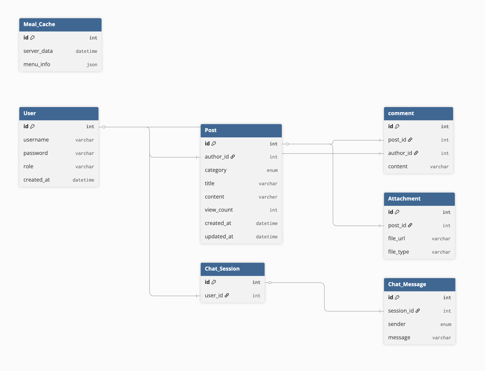

## ERD 설계

서버 세팅에 앞서, 지난번 정했던 최소 기능을 바탕으로 ERD를 설계해보았다.

1. 권한 기반 인증 시스템
2. 게시판 CRUD
- 학교 공지사항, 교육 정보, 학생 마당 등 게시판 기능 구현
- 게시글 작성, 수정, 삭제 기능
- 게시글 목록 조회 및 상세 조회 기능
- 게시글 검색 기능
- 댓글 기능
1. 외부 데이터 API 연동
- 급식 메뉴, 학사 일정 등 외부 데이터 연동
1. 챗봇 기능

원래 ERD Cloud로 작성해보려 했는데, dbdiagram의 기능이 흥미로워 보여서 dbdiagram로 작성해보았다. 

dbdiagram은 ERD를 작성할 때, SQL과 유사한 문법을 사용해서 테이블과 관계를 정의할 수 있다. 또한, 작성한 ERD를 다양한 형식으로 내보낼 수 있어서 편리했다. 게다가 테이블간의 관계도 시각적으로 표현하는 기능도 있어서 정말 좋았다! 

```sql
Table User{
  id int [pk, increment]
  username varchar
  password varchar
  role varchar
  created_at datetime
}
```
*dbdiagram에서 User 테이블을 정의*




이와같이 깔끔하게 시각화되어 나온다! 

## 서버 세팅

이번 포스트에서 가장 애먹었던 부분이었다. Node.js를 오랜만에 다루는 것도 그렇지만, Express.js로 서버를 세팅하는 과정에서 여러가지 문제들이 발생했다.

- `Express.js`란, Node.js에서 가장 대중적으로 사용되는 웹 프레임워크 중 하나로, 간단한 API 서버부터 복잡한 웹 애플리케이션까지 다양한 용도로 사용된다!


<br>

```bash
npm init
```

프로젝트를 생성하고, 필요한 패키지들을 설치했다. TypeScript를 사용하기 위해 `ts-node`와 `typescript`를 설치했고, Express.js를 사용하기 위해 `express`와 타입 정의 파일인 `@types/express`도 설치했다.

로컬 PC에 데이터베이스를 설치하지 않고, Docker를 사용하여 가상 컨테이너 안에 PostgreSQL을 설치하기로 했다. `docker-compose`를 사용하여 PostgreSQL 컨테이너를 설정했다.

그리고 TypeScript와 가장 호환성이 좋은 ORM인 Prisma를 사용하기로 했다. Prisma는 데이터베이스 스키마를 정의하고, TypeScript 코드에서 데이터베이스와 상호작용할 수 있도록 도와주는 ORM이다. Prisma를 설치하고, `prisma init` 명령어를 사용하여 Prisma 프로젝트를 초기화했다.

- `ORM(Object-Relational Mapping)`이란, 객체 지향 프로그래밍 언어에서 데이터베이스와 상호작용할 때, 객체와 관계형 데이터베이스의 테이블 간의 매핑을 제공하는 기술이다. ORM을 사용하면 SQL 쿼리를 직접 작성하지 않고도 데이터베이스 작업을 수행할 수 있다!

`schema.prisma` 파일에서 데이터베이스 스키마를 정의하고, `prisma generate` 명령어를 사용하여 Prisma 클라이언트를 생성했다. 이후 마이그레이션 명령어를 통해 Docker 컨테이너 안의 PostgreSQL 데이터베이스에 스키마를 적용했다.

