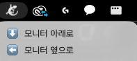

## 개요

학교에서 외부 모니터를 쓰다 보면 종종 위치를 바꾸게 된다. 이를테면 몰래 TFT를 한다던가... 책상 위 공간에 따라 옆에 두기도 하고, 정면에 두고 맥북은 아래에 놓기도 한다. 문제는 그때마다 시스템 설정 -> 디스플레이로 들어가서 배치를 수동으로 바꿔야 한다는 것이다. 몇 번 하다 보니까 꽤 번거롭게 느껴졌다. 그래서 메뉴바 아이콘 하나로 배치를 즉시 전환하는 스크립트를 만들어봤다.

---

## 사용 도구

### displayplacer

[displayplacer](https://github.com/jakehilborn/displayplacer)는 macOS의 디스플레이 배치를 CLI로 제어할 수 있는 도구다. 내부적으로는 macOS의 `CGDisplaySetDisplayMode` 등 CoreGraphics API를 감싸서, 해상도·배치 좌표·주사율 등을 명령어 한 줄로 설정할 수 있게 해준다.

*설치*
```bash
brew tap jakehilborn/jakehilborn && brew install displayplacer
```

### SwiftBar

[SwiftBar](https://github.com/swiftbar/SwiftBar)는 쉘 스크립트를 macOS 메뉴바 플러그인으로 올려주는 앱이다. 스크립트의 `stdout` 출력을 파싱해서 메뉴바 아이콘과 드롭다운 메뉴를 렌더링한다. 별도의 앱 개발 없이 bash 스크립트만으로 메뉴바 앱을 만들 수 있다.

*설치*
```bash
brew install swiftbar
```

## 원리

핵심은 `displayplacer list` 명령어다. 실행하면 현재 연결된 모니터들의 ID, 해상도, 배치 좌표 등을 출력하고, 맨 아래에 현재 상태를 재현하는 명령어를 통째로 출력해준다.

```bash
displayplacer list
```

출력 예시:
```
displayplacer "id:37D8832A-... res:1728x1117 hz:120 ... origin:(0,0) degree:0" \
              "id:9590828F-... res:1920x1080 hz:75  ... origin:(-1920,37) degree:0"
```

여기서 주목할 부분은 `origin` 값이다. macOS는 디스플레이 배치를 픽셀 좌표계로 관리한다. 기준 모니터(맥북)가 `(0,0)`이라면, 외부 모니터의 origin은 **상대적인 위치**를 나타낸다.

| 배치    | origin 예시   |
| ------- | ------------- |
| 왼쪽 옆 | `(-1920, 37)` |
| 위      | `(0, -1080)`  |
| 오른쪽  | `(1728, 0)`   |
| 아래    | `(0, 1117)`   |

즉, 모니터를 옆에 뒀을 때와 아래에 뒀을 때 각각 `displayplacer list`를 실행해서 origin 값을 저장해두면, 그것을 스크립트로 전환하는 것만으로 배치 변경이 가능하다.


## 구현

### 1. 배치별 명령어 저장

모니터를 각 위치에 두고 `displayplacer list`를 실행해서 출력된 명령어를 복사해둔다.

### 2. SwiftBar 플러그인 작성

SwiftBar 플러그인은 일반 bash 스크립트다. 파일명의 형식이 `name.interval.sh`인데, `1d`는 하루에 한 번 새로고침한다는 의미다 (이 플러그인은 상태를 polling할 필요가 없으므로 길게 설정해도 무방하다).

```bash
#!/bin/bash
 
# <monitor-switcher>
# SwiftBar plugin for switching monitor layout
# https://github.com/jakehilborn/displayplacer
 
DISPLAYPLACER="/opt/homebrew/bin/displayplacer"
 
case "$1" in
  below)
    "$DISPLAYPLACER" \
      "id:37D8832A-2D66-02CA-B9F7-8F30A301B230 res:1728x1117 hz:120 color_depth:8 enabled:true scaling:on origin:(0,0) degree:0" \
      "id:9590828F-3368-49D9-8F67-63510FF9B037 res:1920x1080 hz:75 color_depth:8 enabled:true scaling:off origin:(0,-1080) degree:0"
    ;;
  side)
    "$DISPLAYPLACER" \
      "id:37D8832A-2D66-02CA-B9F7-8F30A301B230 res:1728x1117 hz:120 color_depth:8 enabled:true scaling:on origin:(0,0) degree:0" \
      "id:9590828F-3368-49D9-8F67-63510FF9B037 res:1920x1080 hz:75 color_depth:8 enabled:true scaling:off origin:(-1920,37) degree:0"
    ;;
esac
 
# 메뉴바 표시
echo ":lizard.fill:"
echo "---"
echo "⬇️  모니터 아래로 | bash='$0' param1=below terminal=false refresh=true"
echo "⬅️  모니터 옆으로 | bash='$0' param1=side terminal=false refresh=true"
```

### 코드 흐름
 
스크립트는 크게 두 역할을 한다.
 
**1. 배치 전환 (case문)**
 
SwiftBar는 메뉴 항목 클릭 시 `bash='$0' param1=below` 같은 형태로 스크립트 자신을 인자와 함께 재실행한다. `$1` 값에 따라 `below` 또는 `side` 분기로 나뉘어 해당 displayplacer 명령을 실행한다.
 
**2. 메뉴바 렌더링**
 
`case`문이 끝난 뒤(혹은 인자 없이 실행됐을 때) 아래 `echo` 구문들이 실행되며 메뉴바 UI를 그린다. SwiftBar는 스크립트의 표준 출력을 파싱해서 메뉴를 구성한다.
 
- 첫 번째 줄: 메뉴바에 표시될 아이콘
- `---`: 구분선
- 이후 줄: 드롭다운 메뉴 항목


**3. SF Symbols 아이콘**
 
SwiftBar는 `:symbolName:` 문법으로 SF Symbols를 바로 사용할 수 있다. `lizard.fill`을 사용했는데, 모니터와는 관련이 없지만 계속 상단바에 올려놓을 거고 내가 파충류를 좋아해서 선정했다.ㅎㅎ 

```bash
echo ":lizard.fill:"
```


